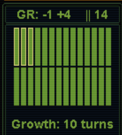

# SMACX - The Will to Power - mod

The Will to Power is a playing experience enhancement mod for SMAX (Sid Meier's Alien Crossfire).
It is built on top of Thinker mod. (Thinker mod info: Thinker_Readme.md, Thinker_Details.md, Thinker_Changelog.md).

##### Links

* [This readme](https://github.com/tnevolin/thinker-doer/blob/master/README.md)
* [Changelog](https://github.com/tnevolin/thinker-doer/blob/master/wtp_changelog.md)
* [Strategy tips](https://github.com/tnevolin/thinker-doer/blob/master/wtp_strategy.md)
* [Issue submission](https://github.com/tnevolin/thinker-doer/issues)

## Special thanks and acknowledgements

* Induktio: Created Thinker mod which greatly improves AI intelligence and makes game much more challenging.
* bvanevery: Play testing and help in design. Especially nice ideas and analysis in area of reactors and combat.
* dino: Play testing and alternative combat round resolution mechanics idea.
* Nevill and Tayta Malikai: Multiplayer play testing and multiplayer text configuration.
* Tayta Malikai: text designer, crash reports, debugging, and test cases investigations!
* Mercantile Interest: Alternative nutrient model idea.
* EmpathCrawler: Play testing. Discovered Brood Pit morale bug.

## Why this mod?

There are tons of interesting features in the game. Many of them are revolutionary for 4X games world. I don't think there is another so feature reach game. I **DO** want to try them all!

With great power comes great responsibility, though. The more features game has the more difficult is to make them work together. A slightest change in parameters or implementation may renders many of them completely broken, unusable, strategically inviable, or shadowed by other features. It is time consuming art and craft of game testing and perfecting. There is no doubt SMACX is the greatest games of all time. However, a lot of features do not integrate into the game well.

Any option/feature/strategy should have its use in some play style of game situation. There should not be any over/under powered feature.

# Design concepts

Whenever I see some feature worth improving/highlighting these are guidelines I use to decide whether I should touch it at all and, if yes, to which extent. By default I try to not fix what is not obviously broken.

* Feature should do what it claims to. If it is impossible to make it work, such feature should be excluded. Example: Deep pressure hull.
* Feature should not outright contradict or break game concepts. Example of game concept: build-your-own-unit design workshop. Example of the feature directly contradicting this concept: hybrid components (resonance armor and such).
* Game flow and features generally should be understandable to people and have clear visual effect on the game and player choices. This doesn't mean they should resemble real life. They should be only what is expected of them by average game player. There should be no hidden elements or algorithms those are difficult to grasp and apply. Example: unit cost formula. In vanilla infantry attacker 10-1-1 unit costs 5. With that in mind average player with previous Civ1/2 experience naturally would expect same strength infantry defender 1-10-1 to cost the same. They would be shocked to discover that it is 20 in SMACX actually. This doesn't match player expectations.
* There should not be any extremely overpowered or underpowered strategy. Each strategy should be viable at least at some circumstances. This mod does not intent to "balance" anything but only to adjust some obvious favorite or underdog strategies. Overpowered strategy example: indestructible army.
* Being usable also means to come at the right time in research tree. Coming too early clutters game interface and takes space from other more needed features. Coming too late causes unnecessary slowdown and frustration. This mod adjusts item appearence times to match faction development level.
* Some items naturally come in sequence when successor effectively obsoletes its predecessor. Good example is weapons and armors. This mod tries to spread them evenly on a research scale so player can enjoy each for about same time. It also tries to link their corresponding technologies to assure they appear in right order. 
* Mutually exclusive items/features are adjusted in price and effect so that they can compete with each other and none is completely inferior. Good example is social models.

# Technology tree

A lot of above changes require moving items and features up and down technology tree. Apparently, rearranging technology tree is inevitable. This may seem like a big change for users. Therefore I dedicate a whole section to explain my reasons.

Rearranging technology tree is not something unheard of. A lot of mods do it and produce quite playable experience. The trick is in accuracy and placement since handling a dependency tree is nontrivial work.

SMACX futuristicly named technologies have no roots in real scientific history except maybe Fusion Power :). This is done, obviously, on purpose to highlight a sci-fi atmosphere. Same story is with other in game concepts, items, and features. Nobody can rationally explain why technology has such prerequisites or why it allows certain game features. I agree that *some* technology-feature relations make sense but most do not. In this regard I believe fiddling with technology tree is an acceptable modding approach. One could memorize some game concepts after thousands of games, of course but I doubt this is the way to go. Most of the time I find myself browsing help to understand which technology uncover which feature. That is completely fine and that is what help is for.

I tried to minimize technology tree changes to satisfy my modding needs only and to not get highwire about it. I selected one primary feature for each technology among those it uncovers. Such primary feature is the most memorized and most important technology association. In other words, player usually researches certain technology for its primary feature. Example: Doctrine: Air Power for needlejet chassis. I firmly kept such assosiations. Everything else might change. However, I also tried to keep modified tree as close as possible to vanilla one. Technologies may float but they do not go far from where they were originally. Like Biogenetics is still early game technology while Advanced Spaceflight is still late game one. I also tried to preserve secondary assosiations whenever possible to not mix things up too much.

I think I did good job on linking technologies. Vanilla technology level quite inaccurately predict technology appearance time. My tree is built with exactly 7 technologies per level. Each technology prerequisites are exactly from two below levels. This puts a pretty good timeline and value on a technology which is a great help for technology exchange. You know right away that any level 4 technology is clearly farther up the tree than any level 3 one - no need to look them up in datalink. Now it is easy to predict relative technology appearance time by its level.

###### Note to users

I have selected primary features based on my own understanding of their importance. If someone believes there should be a different primary association - let me know. I'll gladly substitute. After all, the technology is just a placeholder for features and can be replaced or even renamed as needed.

Keep in mind that technology prerequisites are generally arbitrary and serve as interlevel relations only. Preserving some beelines is an option but not a primary concern. I welcome any suggestions about rearranging and relinking technology tree to match game lore.

# Social Engineering

Modding Social Engineering is the project in itself. There is no right and wrong answer on that. However, I expressed my view in the article here that also contains references to contemporary updates with explanations.
http://alphacentauri2.info/wiki/Social_Engineering_Mod

# Combat

## Attack/defense ratio adjustment

Overpowered strategy: Indestructible army.  
Cost/benefit imbalance: Conquering whole planet for near zero cost investment in army reinforcement.  
Consequences: Conquering the whole world can be easily done in the mid game with minimal investments. The conquest victory become the easiest and earliest achievable. Other victory conditions almost never apply especially the ascent to transcedence. One needs to delay the victory **on purpose** just to enjoy other victory types. :frowning_face:  
Fix: adjust weapon and armor progression, attack/defense ratio, combat unit costs, military facility costs so that equally developed invader lose more units conquering enemy bases than defender and would require constant resupply to keep further advancement. In economical terms capturing a base should cost 2-3 times more in unit mineral cost to assailant than to victim. That is, of course, holds true only for attacking **prepared** defense of same technologically developed opponent. More advanced weaponry decreases player relative losses, obviously. Hefty price on conquering enemy bases makes non-stop conquering strategy not always a best choice. War related economical stagnation could be a too severe consequence for expansion.

To support the point above weapon and armor rating in this mod go 1:1 until about end of the game. The top weapon is about 20% stronger than top armor. Not that this difference is important at the end game where winner is essentially determined already. This is the point of this mod: let factions effectivelly defend themselves throughout the game and do not crack under slightest pressure in the middle ages. It doesn't stop anyone for crushing their enemies with enough dedication and skills. However, as it was already pointed earlier, such crushing comes with the price and peaceful development is a completely viable alternative to war.

###### Note to users

Large number of conventional weapon items (12) in the game presents two potential improvement areas.
One should experience war conflict in each of 12 first technology levels to enjoy each and every weapon/armor item. This is practically impossible and, therefore, big part of weapon/armor items is inevitable unused. It does not contradict my principle as each one can still be used over the course of multiple games. Yet, if anyone believes there are too many of them, I can reduce number of weapons to 8 or something.

## Weapon and armor value progression

Weapon and armor strength progression was redone to resemble Civ 1/2 slow proportional growth. Indeed, I cannot imagine why developers would left such weird weapon strength progression as 2-4-5 (?) or 12-13-16 (?) :confused:. Whereas it is completely easy to correct it to normal growing progression by just changing text configuration. I've adjusted other weapon strenghts too to smoothen overall strength progression. Each next level item is about 25% stronger starting from value 4 onward.

Vanilla game has very weird code that selects regular conventional weapon icon based on its offensive value. There is nothing like that for any other item types (non regular-conventional weapons, armor, chassis, ability). Very precise, specific, and meaningless piece of programmatic machinery.
This is fixed now. Modders are free to set any offensive values to regular conventional weapons without breaking their respective icons! Woo-hoo, thanks to me.

With this in mind I was able to correct weapon strenght progression to smooth it while keeping proper icons for each weapon.

## Combat mechanics

### Round odds fix

Vanilla random roll method resulted in incorrect combat round odds. This is fixed now. Round odds are now proportional to unit corresponding strengths as it should be. :wink:

### Odds confirmation dialog fix

Odds confirmation dialog now displays correct winning probability percentage. Vanilla odds numbers look cool but are highly unusable without calculator not even mentioning they are incorrect to begin with.

## PLANET rating effect on combat

Native warfare seems to be everybody's weapon in vanilla. It doesn't seem fair to PLANET oriented factions. In base game PLANET rating is very weak comparing to say INDUSTRY/RESEARCH. It should be at least comparable to justify Cult of Planet's -1 INDUSTRY penalty. In my mind even ±1 PLANET rating should be *very* noticeable. Therefore, this mod increases its combat bonus to 15%. It also applies it on both attack and defense so PLANET haters suffer significant penalty. Now running Free Market really forces player to build up anti native base defense - mere avoiding combat is not a good strategy anymore.

On top of that this mod sets land psi combat base odds to 1:1. This way PLANET rating controls advantage/disadvantage in psi combat, correspondingly. It also brings psi attack odds against Trance unit in base (1:2.25) in range with conventional attack odds against base with PD/TF (1:2 - 1:3). This last change, though, could be undesired for many players as I found out already. Luckily, it is configured in alphax.txt. So anyone can roll it back or set to any other preferred value.

## Base intrinsic defense and defensive structures

Base intrinsic defence raised to 50% to match rough terrain protection.

Base defensive structures (Perimeter Defense, Naval Yard, Aerospace Complex, and Tachyon Field) defense bonuses are exposed in thinker.ini. First level structures defense bonus is left 100% as in vanilla. That effectivelly adds 50% on top of intrinsic defense. Second level structure (Tachyon Field) defense bonus is +50% to match first level bonus increase and to avoid late game overdefence that is many modders major concern.

| Defense structures | Cumulative bonus | Cumulative multiplier |
|----|----:|----:|
| No structures | +50% | 1.5 |
| Level 1 | +100% | 2.0 |
| Level 2 | +100% | 2.0 |
| Level 1 and Level 2 | +150% | 2.5 |

## Fanatic attack bonus

Believers are quite narrow focused faction. Their SUPPORT and Fanatic attack bonus makes them powerful large army warfare machine. This is what they **should** be doing to succeed as they suck at everything else with their RESEARCH and PLANET penalties. Surprisingly, their attack bonus is not that remarkable. Even Usurpers are better with their +25% attack bonus as they apply it to all type of combat including psi. Since believers are pathetic in psi combat their conventional attack bonus should be at least greater than Usurpers'. Assuming that even in the best circumstances they are not going to be in permanent war state raising their attack bonus to 50% is not at all overpowered. This is a compensation for their poor economical development.

## Alternative artillery damage

Vanilla artillery damage is proportional to weapon/armor ratio *rounded down*. That means artillery cannot even harm too tough opponent above certain threshold. For example 2 strength artillery **cannot possibly** harm 3 armor strength unit anywhere in vanilla! That is completely ridiculous as the primary artillery purpose is to soften tough opponents before hand-to-hand combat.

This mod introduces a small correction to the game formula when the above ratio is below 1. Instead of doing zero damage artillery have a chance to do 1 damage proportional to attacking artillery strenght. It is a logical fractional continuation of original whole number formula.

Additionally artillery damage is multiplied by attacker firepower to ignore defender reactor power as it is done for hand-to-hand combat as well.

## Repair rates

Repair rates are lowered to eliminate fast and instant healing. Parameters are configurable.

| Location/Facility/SP | Repair rate, per turn | Maximal repair level |
|----|----:|----:|
| Field | 10% | 80% |
| Base/bunker/aribase | 10% | 100% |
| Conventional unit in base with corresponding land/sea/air repair facility | +10% | 100% |
| Native unit in base when faction owns SP for fast native repair | +10% | 100% |
| **Anywhere** when faction owns Nano Factory | +10% | 100% |

## Morale

[Treatise on Morale](http://alphacentauri2.info/wiki/Treatise_on_Morale)

The article above is a good example of what we are dealing with here. An excellent scholary research explaining miriads of small SMACX morale releated features and their interdependencies. A lot of enthusiasts worked a lot of man-months to disassemble, reverse engineer, and deliver this sacral knowledge to us in more or less orderly fashion. Even after all these efforts mere reading this article and trying to comprehend all intricacies of game engine is a work in itself. I personally sometimes have to read passages few times to catch the idea and details.

Undoubtfully, such complicated rules should not even exist in a game in a first place for players' sake. And if they do they should be clearly explained with every detail at least in advanced help. Apparently designers realized that such help would take like 20 pages of in game text. That could scare beginners! Better to replace it with one-two vague sentences or not mention it at all. Clarity achieved = profit! In literal meaning. :smile:

Now players need to disassemble game to understand why their units have unexpected morale. Ugh. :unamused:

### Children Creche and Brood Pit morale bonuses

Removed all Children Creche and Brood Pit related morale bonuses. That includes home base bonuses as well as stationed base bonuses.

Reason: undocumented, awfully bugged, exceptionally convoluted, apallingly obscure to user formulas.

Children Creche and Brood Pit are quite strong facilities by their primary purpose already. They don't need to invade specialized morale facilities domain.

Some may refer to this passage from Datalinks: "All negative MORALE effects are cancelled for units in base square; instead such units receive a +1 MORALE modifier." It is hardly a documetation for such complex mechanics. See [Treatise on Morale] at the top of Morale section. Psi units also receive similar bonus from Brood Pit on top of Children Creche's one but this is not documented at all.

### Very Green defense bonus

Designers added tons of little trinkets for player so they don't feel sorry for themselves and don't stop playing game in first few turns. As important as it is for absolute newcomer this is a pure annoyance to a seasoned player who doesn't quit just because they don't see a measly bonuses everywhere they look.

One of such nonsense bonuses is a Very Green defense bonus effectively turning it into Green on defense. I absolutely welcome any number of independent means to raise/lower morale in addition to base unit morale levels. However, assigning a special bonus to the very basic morale level that effectivelly disables its intended effect (even if on defense only) is beyond my comprehention.

### Promotion probability

[Vanilla formula disassembled](http://alphacentauri2.info/wiki/Treatise_on_Morale#Reverse_engineered_Battle_Upgrade_formula)

Surprisingly, the vanilla formula is very sensible. Essentially, promotion odds are proportional to opponent to victor strength ratio as well as to how badly both you and opponent got damaged in battle. The only problem with it is that Very Green and Green units skip this calculation and are always promoted. That opens a pandorra exploit box as player can wind down their MORALE rating to lower their units morale and then quickly acquire 1-2 promotion levels.

I decided to even out promotion probabilities across all levels to decouple from MORALE rating jumping up and down. Now all probabilities are same as for Commando->Elite promotion. For example, when two equal units fight they both have 50% chance to win and then victor has 25% chance to be promoted.

Besides, why promotion should be easier for lower morale levels? That benefits weak morale factions. It should not. They have low morale for a reason. It most likely a flip side of having some other good benefit either innate or SM induced. The combination of bonuses and penalties is already carefully thought of by faction/SM designers. Why game thinks it knows better and aid to these poor "weaklings" as it percieves them?

# Unit cost

Unit cost formula is reworked and is greatly simplified to resemble Civ 1/2 model. Now it is **MUCH** easier to understand this. For example, both 6-1-1 and 1-6-1 infantry units now cost 6 rows of minerals. Imagine the simplicity! New formula completely removes a quadratic armor cost growth problem. High end mixed inrantry units now cost comparable to speeder and fully armored foil units are comparable to hovertank.

## Reactors

Reactor power does not multiply unit max hit points anymore. All units (conventional and native) have 10 max hit points regardless of reactor.

Instead each subsequent reactor decreases weapon/armor cost by approximately 20%. Modules are not discounted. Player **does not** get refund when upgrading unit to cheaper one with more powerful reactor.

## Unit pricing principles
* Primary item (most expensive module/weapon/armor item) defines base cost.
* Secondary item (least expensive module/weapon/armor item) increases cost just by 50% of its value to encourage mixed units usage.
* Faster chassis make unit proportionally more expensive. Speeder/Cruiser are 1.5 times and Hovertank is 2 times more expensive than Infantry.
* Stronger reactors decrease weapon/armor cost by 20% comparing to previous generation.
* Abilities have now proportional and flat cost components those can be set independently for each ability. Proportional one works as in vanilla and increases cost by 25% for each unit value. Flat cost adds given number of minerals rows to the cost.

## Unit cost formula

Ability proportional and flat costs are packed into a singe value for ability cost in alphax.txt. First 4 bits are used for proportional cost and second 4 bits are for flat cost. Ability may have both proportional and flat non zero costs.

<pre>

unit cost = round(round([primary item cost + secondary item shifted cost / 2] * chassis cost / 2) * abilities cost factor + abilities flat cost)
(rounded normally)

item reactor modified cost = item cost * (reactor value / 100)
module uses Fission reactor value for their reactor value

primary item = the one with higher reactor modified cost
secondary item = the one with lower reactor modified cost

primary item cost = item cost * (reactor value / 100)
secondary item shifted cost = (item cost - 1) * (reactor value / 100)

abilities cost factor = (1 + 0.25 * (ability1 proportional cost + ability2 proportional cost))
abilities flat cost = ability1 flat cost + ability2 flat cost

</pre>

## Weapon and armor cost

Weapon and armor cost grows slightly slower than their value. That makes stronger weapon/armor more cost effective against stronger opponent. However, it is still cheaper to build weaker units when top item is overkill.

## Flat extra prototype cost

Flat extra prototype cost formula is introduced.

<pre>
extra prototype UNIT cost = sum of non yet prototyped extra prototype COMPONENT costs
extra prototype COMPONENT cost = component costs * Extra percentage cost for LAND unit
</pre>

This formula changes the actual unit cost. The literal text in base screen item description (like "prototype: +50%") stays the same and displays the percentage value from alphax.txt. This may be confusing. I may change it in future releases.

##### Prototype cost bug in vanilla

Vanilla uses *Extra percentage cost of prototype LAND unit* percentage for designing brand new unit in design workshop regardless of selected chassis. Therefore *extra percentage costs* for all triads should be kept equal. For the same reason alternative formula above uses LAND percentage only.

# Mineral contribution exploit fix

INDUSTRY rating is supposed to modify base production speed. Instead it modifies production item mineral cost, due to strange design approach. This allows few exploits as well as tangling between INDUSTRY rating and hurry cost. Following changes were introduced to avoid all these problems.

* All direct mineral contributions are scaled to basic mineral cost multiplier in alphax.ini. That effectivelly ignores INDUSTRY rating impact on such contributions.
  * Alien Artifact is cached at base contributing to project or prototype production.
  * Unit is disbanded at base contributing to current production. This is actually already scaled in vanilla so no changes were needed.
  * Hurrying production. Hurrying cost is not dependent on INDUSTRY rating anymore.

# Secret Project costs

Increasing cost of SP to make AI build it longer so that other AI and human can compete longer for them and less research advanced factions can still get some of them.

I also clearly understand that exact SP cost is not that relevant. It easily can be moved 50% up or down and nothing changes much in the game. My main concern was their way to low cost in vanilla. I feel like they should be about 2-5 times more expensive based on benefits. Other than that I welcome your suggestions.

#### General pricing rules

##### SP replacing facilities those are beneficial in every base (The Planetary Energy Grid)

<pre>
10 * facility cost in minerals + 100 * facility maintenance in credits
</pre>

##### SP replacing facilities those are not beneficial in every base (The Command Nexus)

Same as above but reduced by some arbitrary usability factor.

##### SP providing tangible benefit (The Human Genome)

<pre>
100 * facility benefit in energy
200 * facility benefit in minerals
</pre>

##### SP with unique abilities (The Xenoempathy Dome)

arbitrary

## SP cost table

Cost in mineral rows.

secret project | cost | explanation
----|----:|----
The Merchant Exchange | 20 | Local improvement - no change.
The Human Genome | 40 | 2 minerals worth quelled drone x 200
The Command Nexus | 60 | 80 cost x 10 + 2 maintenance x 100. Reduced as it is not needed in every base.
The Universal Translator | 100 | Labs +30% and two free techs.
The Weather Paradigm | 40 | Tough to evaluate. Great boost to the faction via advanced terraforming but advantage doesn't last whole game.
The Empath Guild | 60 | Way to Governorship and energy income multiplier. Should be quite expensive.
The Living Refinery | 40 | About 2 minerals per base per turn x 200.
The Virtual World | 60 | 60 cost x 10 + 2 maintenance x 100. Reduced slightly since it benefits base only when network node is built.
The Planetary Transit System | 40 | Drone quellying + immediate growth boost. Proportional to empire size but limited to small bases only. Slight increase.
The Maritime Control Center | 60 | 80 cost x 10 + 2 maintenance x 100. Reduced as it is not needed in every base.
The Planetary Datalinks	| 80 | Again pretty vague but should be quite high priced since technology advantage is everything in this game.
The Manifold Harmonics | 60 | Powerful fungus production. However, advantageous for high PLANET rating only and fully develop only in later game.
The Planetary Energy Grid | 60 | 60 cost x 10 + 1 maintenance x 100.
The Citizens' Defense Force | 60 | 50 cost x 10. It worth more than the cost of the facility as it gets built immediatelly in conquered base.
The Xenoempathy Dome | 40 | Tactical advantage, aid to fungus terraforming, +1 lifecycle = slight increase.
The Supercollider | 30 | Labs +10%.
The Ascetic Virtues | 60 | +POLICE + growth = slight increase.
The Theory of Everything | 60 | Labs +20%.
The Hunter-Seeker Algorithm | 60 | No clue how to deal with this. People tend to value it quite high. Doubled the price.
The Nano Factory | 40 | Slight tactical and unit upgrade advantage. Nothing seriosly game changing. No change.
The Longevity Vaccine | 60 | Drone quellying. Slightly higher valued than The Human Genome due to more advanced era.
The Nethack Terminus | 60 | Some help to probe teams. Other than that nothing much.
The Neural Amplifier | 80 | Tough to evaluate but I tend to price combat effectiveness boosting projects quite high.
The Pholus Mutagen | 60 | Allows higher production without ecology impact. Should be slightly more expensive.
The Dream Twister | 80 | Same as The Neural Amplifier.
The Cloudbase Academy | 150 | 120 cost x 10 + 3 maintenance x 100. Not reduced at all as AC is needed in every base for satellites later on.
The Cyborg Factory | 160 | 200 cost x 10 + 5 maintenance x 100. Reduced by 1/3 as it is not needed in every base.
The Clinical Immortality | 200 | Drones and diplomatic victory. Should be quite high.
The Singularity Inductor | 200 | 200 cost x 10.
The Bulk Matter Transmitter | 200 | 10 minerals x 200.
The Network Backbone | 160 | Large source of labs multiplied by the number of all world bases. Very high.
The Self-Aware Colony | 200 | Roughly 20 maintenance x 100.
The Space Elevator | 160 | Economy boost in base, satellites production boost, planetary orbital insertion. Few good things but not game breaking ones. Should be averagely priced for its era.
The Cloning Vats | 120 | Adds GROWTH rating. Good for growth but not game breaking.
The Telepathic Matrix | 200 | Total drone solution. About 5 times The Human Genome cost. 
The Voice of Planet | 120 | 
The Ascent to Transcendence | 500 | Should take some time but not to extreme with all empire bases contribuing to it.

# Multiplying facilities

Multiplying facilities are incentive for base growth vs ICS. Multiplying facilities, especially mineral ones, should start earlier and distributed more evenly across the tree.

Recycling Tanks now is a 50% mineral multplying facilities among others of same type. Other multiplying facilities are distributed more smoothly across the tree.

Energy multiplying facilities are generally at good places already. I've reduced cost of some early coming ones to make their benefit appear earlier.

# Feature appearance time

## Foil

Doctrine: Flexibility is available to be researched at start. Other modders said much about that already.

## Network Node, Energy Bank

Moved to level 3.

These facilities are not effective at the beginning. Even with 20 raw energy yield they contribute 5 labs/energy - 1 maintenance = 2 worth of minerals and break even in 30 turns. First base doesn't reach this raw energy intake until turn 50 something.

## Hab Complex, Habitaion Dome

Hab Complex: moved to 20% in research tree (was 30%).

Habitation Dome: moved to 50% in research tree (was 75%).

I don't want AI like Morgan or Pirates to struggle and let their base not grow for an extended period of time. Game is too short already.

## Non-lethal methods

Moved to 75% in research tree (was 50%).

Doubling police power should not come too early.

## Bioenhancement Center

Bioenhancement Center: moved to 75% in research tree (was 50%).

Generic facility should come after all specific ones.

## Tree Farm, Hybrid Forest

Tree Farm: moved to 30% in research tree (was 50%).

Hybrid Forest: moved to 60% in research tree (was 50%).

These facilities should be moved apart a little. In vanilla they appear immediately one after another. Tree Farm should appear a little bit earlier to support barren lands with forests.

## Satellites

Satellites appearance order is changed to: Orbital power transmitter, Nessus mining station, Sky hydroponics lab.

Sky hydroponics lab is moved to the last as most base affecting. Other two are comparable in effect to corresponding multiplier facilities.

## The Living Refinery

This project effect diminishes with time as SUPPORT effect becomes less important when bases produce more minerals.

## The Manifold Harmonics

It is not too strong a project and it is not too beneficial early in a game when base fungus production is yet too low. There is not harm to place it early for owner to benefit its advantage for longer period of time.

## Reactors

They appear approximately at 25%, 50%, 75% of the tech tree, correspondingly, to be used about same amount of time each.

## Aqua facilities

Aqua facilities appearance order is changed to: Thermocline transducer, Subsea Trunkline, Aquafarm.

Aquafarm comes last as most effective facility of them all.

# Terraforming and yield

## Yield restrictions

This is another feature I cannot understand. What good does restricting yield do? Why I cannot farm a rainy tile to boost my base growth a little? Why I cannot mine a rocky tile to get myself some minerals? In vanilla game these restriction are lifted when you discover advanced terraforming. At this time I don't need a rocky mine anymore since borehole is better. As the result I never build mines to work on - only to harvest by crawler. I don't know how to disable them completely so I moved them all onto level 1 technologies.

I guess this was a blind copy of Civ 1 Despotism restrictions. Despotism reduces any factor of production by 1 where you have 3+ of such production. However, this was compensated by unit production and settler food supports. Meaning you harvest less but you spend less on support too. SMACX lost this second part separating support into its own effect. Thus leaving this nicely thought and designed element half cut and stupid looking. :angry:

## Forest

Many people before me mentioned overpowed forest. Indeed, it is capable of turning dry and barren 0-0-0 terrain into 1-2-1 adding 4 resourses in 4 turns with combined yield comparable to rocky mine. It is just insane terraforming effectiveness. As if this is not enough it spreads by itself = zero further investments. It is pretty nice option for poor bases but it should cost more than mine to be not the-only-viable-option. Currently I set its terraforming time to 8.

## Fungus production

Fungus production is not some crucial part of the game. However, it is still some alternative yield source that is mostly overlooked due to very slow development comparing to conventional terraforming. I'd like to add few touches on it.

| technology | level | effect | cumulative yield | comment |
|----|----:|----|----|----|
| Centauri Ecology | 1 | +1 nutrient | 1-0-0 |
| Progenitor Psych | 1 | +1 energy | 1-0-1 | reassigned |
| Field Modulation | 2 | +1 energy | 1-0-2 | reassigned |
| Bioadaptive Resonance | 4 | +1 nutrient | 2-0-2 | reassigned |
| Centauri Meditation | 5 | +1 energy | 2-0-3 |
| Centauri Genetics | 8 | +1 mineral | 2-1-3 |
| Centauri Psi | 11 | +1 nutrient | 3-1-3 |
| Secrets of Alpha Centauri | 13 | +1 energy | 3-1-4 |

## Sensors

Sensors are available on land and sea and confer both attack and defense bonus.

# Base growth tuning

In vanilla land moisture is extremely important. To the level that early game base cannot even feed itself on arid land and is barely even on moist. Rainy land or food bonuses (especially jungle) gives an enourmous and unfair advantage. Mathematically speaking, nutrient surplus generated by different rainfall level terrain (arid, moist, rainy, jungle) is: {-1, 0, +1, +2}. Meaning that only rainy terrain can sustain stable growth. This slightly changes with appearance of condencers. However, it still requires a lot of them to turn desert into inhabitable land. Soil enricher eventually turns all lands to sustainable enough. Forest + TF/HF have about same effect on arid land.

It is not a completely bad idea restricting early expansion to most habitable land and then slowly unlocking the rest of the territory with more advanced technology. Brilliant even! Unfortunately, as with many other brilliant SMACX inventions, it creates severe disbalance. Landing on jungle is equivalent to early population boom.

With that in mind, WPT intoduces few changes.

## Yield restrictions are disabled

All yield restrictions are disabled. It would make *some* sense to reduce *all* yield by certain amount until unlocking certain technology. However, limiting rainy farm nutrient yield with 2 while still allowing jungle farm to produce 4 nutrients makes *none*.

## Farm yield is increased to 2

This turns (arid, moist, rainy, jungle) farm nutrient surplus from {-1, 0, +1, +2} to {0, +1, +2, +3} achieving following:
1. Jungle is only 1.5 times better than most fertile non-jungle land now, not twice as in vanilla.
2. More land is habitable in the early game allowing better placement even for most geographically deprived factions.

## Nutrient box width is increased to 20

That is to compensate farm increased yield and revert average base growth to that of vanilla. Otherwise, they will just skyrocket.

_Comparative base growth_

This shows farm contribution to base growth for an old and new mechanics.
Numbers are for estimated population increase in 10 turns on different land.

| rainfall | vanilla | WTP     |
| -------- | -------:| -------:|
| arid     | -1.0    |  0.0    |
| moist    |  0.0    |  0.5    |
| rainy    |  1.0    |  1.0    |
| jungle   |  2.0    |  1.5    |

As you can see, the growth is about same for average early base with less spread between different terrain types.

## Final word

Let me reiterate it that bigger spread in land fertility base growth effect allows very interesting "fight for better base placement" mini game. However, the limited amount of land and random initial location turns it into pure game of chance taking all intellectual competition out of it. If anyone can propose a better fix I would be very glad to consider it!

# Secret Project logic

Crawlers are disabled. That solves tons of problems they create.

## Hurrying projects

Factions can fully or partially hurry projects with credits at their discretion.

## Specific project fixes

### The Planetary Transit System

The main problem of this project reported by many players is that it breaks the game paired with ICS strategy. Essentially, it creates two extra citizens out of thin air in a new base. Therefore it just triples the benefit of founding a new base and the total faction population growth rate.

This mod limits the size of a new base to this value:

<pre>
new base size = average faction base size - 2
</pre>

This is to prevent excessive total population growth at very early stages. It also sets the limit to **less** than average to make sure the benefit automatically wears off when a lot of new bases created. Since the limit is less than average it guarantees that the creation of a new base brings the average size down. So player needs to develop the rest of their bases to keep claiming the maximum benefit.

### The Cloning Vats

Permanent population boom in all bases is one of the most game breaking effects in entire SMACX. Modders struggle to mitigate and balance it. This mod moderates this project effect to the level comparable to other project effects.

The Cloning Vats do not trigger population boom. Instead they add +2 GROWTH.

The Cloning Vats also does not grant impunities anymore.

## The Hunter-Seeker Algorithm

The Hunter-Seeker Algorithm prevents regular probe action but does not destroy it. This is to aid the AI that stupidly keeps sending probes against the HSA owner. This is also to reduce human player frustration when they need to remember which enemy faction has HSA to not kill own probes for nothing.

# Inefficiency

Inefficiency formula reworked. It uses "efficiency" as a complenetary measure for inefficiency.

<pre>
seEfficiencyRate = (4 + EFFICIENCY) / 8                          ;limited to [0; 1] interval
hqEfficiencyRate = 1 - distance to HQ / (1.5 \* map width / 4)   ;limited to [0; 1] interval
efficiencyRate = seEfficiencyRate + hqEfficiencyRate             ;limited to [0; 1] interval
efficiency = efficiencyRate \* energy intake                     ;rounded up
inefficiency = energy intake - efficiency
</pre>

# Miscellaneous

## Special weapon and armor

Disabled all hybrid and psi items.

I really cannot grasp this concept. Why having a half strength ability while you can attach a fully powered one for the same price? Besides, the mere melting ability to the item breaks the unique SMACX unit workshop build-it-yourself paradigm! Why to introduce a constructor tool and then provide pieces that cannot be disassembled to elementary properties. I almost never use them for their added ability. Merely like another regular piece of equipment. And now in my mod they don't exist anymore and nobody cries.

Same story with psi weapon and armor. By the time you get them you have full spectrum of natives who are much cheaper than psi attack + psi defense unit. I personally never used them. Anybody does? Let me know if you think they are valuable assets.

## Removed abilities

Cloaking device and Deep pressure hull abilities are broken by game shared map implementation. Other people said enough about it. Disabled them.

Repair Bay ability is useless in my mind as well. I cannot even imagine where one would massively transport wounded units.

Soporific Gas Pods. People reported AI doesn't use them due to a bug. I think it would be fair not to give them to humans too until this is fixed.

## Aquatic faction +1 mineral advantage

I was able to remove AQUATIC +1 sea mineral advantage. Now they are back to normal and expected growth. They will be slow on start but they have 50-100 years of undisturbed development. Once their old bases are developed enough to stamp sea pods they explosivly expand but then other factions start barraging waters and set their sea colonies. Seems to be a good balance. However, aquatic factions still develop quite differently. That requires a lot of play testing.

## Disabled probe morale boosting technologies

Some vanilla technologies boost probe team morale for free. That makes all new probe teams elite toward the end of the game. Err, what's the point in that if everybody gets it and this renders Covert Ops and PROBE ratings useless for probe team morale? I removed all such flags. Technologies do not improve probe team morale any more.

## Removed planetpearls energy reserve bonus

Planetpearls give a pretty weird bonus that player gets when killing land only natives (not sea, not air). This bonus goes from 10 to 70 based on killed unit lifecycle. Attacking unit with 3:2 strength advantage has pretty good winning chances. That leads to the harvesting planetpearl exploit when player induces natives appearance by trying to enter fungus tiles on purpose. Gameplay-wise I percieve it as gold coins falling off defeated monsters in Mario. Such a purely arcade element seems quite strategically disconnected from the rest of the game and is very distracting. Native lifeforms should be percieved as a threat not as a treasure.

## Territory distance from sea and coastal bases

SMACX introduces a brilliant concept of a territory. Now no one can stick their own bases in between other faction bases. This prevents a constant micromanagement of shooing **friendly and especially ally** colonies from your territory. It also gives players more high level control of keeping other faction units far enough from your bases. It is a definite playability improvement.

Interestingly, even though SMACX treats land and sea bases equally (which is an epic feature by itself) the sea territory borders do not extend from sea bases as much as on land. Essentially they fail to secure territory even in between already placed sea bases, which is a primary purpose of the territory. It also doesn't serve the secondary purpose of the territory to keep other faction sea units at bay. Sea units move fast and 3 square extended borders equal just a one turn cross distance. The situation with coastal bases is even worse. They extend their sea border 1 square away. It is just ridiculous. It doesn't prevent other players to place sea colony just 2 tiles away denying **ALL** water resources to coastal base. It is a major complaint of many players.

This mod equalizes border extension distances between land, sea, and coastal bases. Even though I believe this is a must have feature the configuration parameter is still in thinker.ini in case anyone wants to switch it off.

## Heavy Artillery and Air Superiority cost

These abilities do not improve unit properties directly. Instead they essentially create completely distinct unit type with its own ins and outs. These unit type strengths are controlled by its own settings in alphax.txt. Damage Numerator & Denominator for Heavy Artillery and Combat bonus/penalty for Air Superiority. Their non-zero cost is confusing as if these abilities are worth something by themselves. I think it is much clearer to keep them zero and allow player to convert the unit type without any additional penalty.

## Population boom fix

Population boom is a powerful feature leading to OP strategy: expand - pop boom - repeat. The population boom is a nice feature. However, its cost is obviously negligible comparing to its benefits.

This mod changes the GROWTH upper cap and thus GROWTH rating requirements for population boom, making it more difficult to achieve.

## Disallowing destroying defensive facilities with probes

Human probes cannot sabotage defensive facilities either by targeting them or by random sabotage.

A disciplined enhanced probe has 50% chance to sabotage targeted PD or TF. A disciplined regular probe has also 100% chance to sabotage a random facility which may be a defensive one. Sabotaging PD reduces base defense by 30%. This is too much of a reduction for the cost of a few probe teams especially against the AI that doesn't protect their bases with counter probes well.

Overall, many players perceive this as an exploit similar to destroying sensor before waging full scale base assault.

## Habitation facilities redesign

Habitation facilities now add +2 GROWTH when below limit giving the incentive to build them earlier.

## Scrambling interceptor fix

Air units without air superiority (bombers) cannot attack needlejets in flight. That suggests that bomber's weapon is designed to bomb ground targets and cannot attack or damage air units.

From the other hand air units with air superiority (interceptors) have their weapon is designed to attack air targets in flight and receive air superiority bonus on top of that. That makes perfect sense since, as we established above, bombers cannot attack air units with their weapon so they use their armor (i.e. protective fight ability) to defend against incoming attack. Their defense in this case can be considered as a combination of anti-interceptor measures those include an actual body armor plus maybe some light weapon turret for counter fire.

All the above works well until interceptor decides to scramble. Scrambling interceptor is supposed to intercept a bomber in flight and counter attack it preventing bombing run. Unfortunately, game mechanics cannot handle this case properly due to code limitations. It computes battle as if a bomber attacks an interceptor resulting bomber using its weapon and interceptor not receiving its air superiority bonus. It looks like a bomber actually bombs an interceptor with its main weapon which makes no sense. Gameplay wise this reduce scrambling interceptor effectiveness by about 20 times comparing to when it attacks bomber on its own turn making this otherwise wonderful air protection idea completely useless.

This mod fixes the type of combat when bomber attacks an interceptor. Besides attacking scrambling interceptor that also may happen when bomber attacks interceptor in (air)base or when bomber attacks low flying units such as copters and gravships. When air units without air superiority attacks another air unit with air superiority it uses its armor value for combat strength and interceptor also receives its usual air superiority bonus. Odds confirmation dialog is not shown and the battle starts right away not giving player a chance to change their mind. In other words combat is happening and computed as if interceptor actively counter attacks bomber not giving player a chance to understand and retreat from their mistake.

Now interceptors become a very useful anti-bombers units. They protect surface units and destroy bombers effectively.

## Scorched earth

When faction looses a base (captured or killed) all terrain improvement on lost territory are destroyed.

# UI changes / cosmetics

## Battle computation display

Adjusted summary strength and power lines to the bottom in battle computation display. This way it is easier to read and compare them between attacker and defender.

## F4 screen labels

Shortened some labels in F4 screen to fit longer base names and avoid line wrapping.

## F4 screen markers

Added a suffix to bases in need of population growth limit facility.

## Base nutrient box information



The header shows the global GROWTH rating, base local GROWTH rating modification, and the resulting number of columns in nutrient box.

The footer shows the number of turns to base growth as well as stagnation and population boom indicators.

Recent changes also allow base to grow same turn when nutrient box is filled up and carry over any exccess nutrients.

# Alternative subversion and mind control

## Subverting unit from stack

The restriction for probe teams to not be able to subvert more than one unit in stack comes from hard-coding and inability to properly handle different units in stack after subversion. There is no any lore to it. 
I have implemented minimal changes to allow subverting units from stack while protecting game from crashing. The subversion functionality is changed as follow.

* Probe attempts to subvert top unit from stack. Player cannot choose. Most of the time this is the unit that is visible on top but there is no guarantee.
* All the normal attack checks are performed: air superiority, amphibious, etc.
* Probe looses all its turns after action and stays on the same tile from where it subverted the unit.
* Subverted unit is moved to the probe tile. Thus avoiding stacking it with enemy after subversion.
* AI check is also modified to allow computer subvert from the stack.

## Subversion cost

* Base cost
	* 30 * unit cost
* Vector distance to HQ coefficient
	* 1.0 if no HQ or more than than quarter the map width
	* 2.0 if at HQ
	* linearly prorated if anywhere in between
* Polymorphic Encryption effect
	* Multiplies subversion cost by (1 + number of stacked or adjacent PE units).
* Unit type coefficient
	* Colony and former cost is doubled

### Polymorphic Encryption effect

In vanilla PE is not really helpful. It would require to equip every unit with it to protect against subversion as any unit can be targeted. Such passive defense is obviously a waste of ability slot. PE gets a second life with ability to protect surrounded units. Now player may just mix few of them with the army to extend their effect. No need to equip each and every unit.

## Mind control changes

Completely revamped the formula based on multiple complaints and requests.

* Removed all easily fluctuating or easily influencable factors such as riot/GA.
* Removed direct cost effect from facilities like GF, CC, and the like.
* Distance to HQ is still a factor but it works in more smooth and sane way, though. Like absence of HQ does not increase cost in some case as in vanilla. Also bases next to HQ won't cost exorbitant anymore.
* Added more base value factors: production, facilities, projects. Bases with project now are not cheap.
* Explicitly and directly added cost of simultaneously subverted units into MC cost!

## Mind control cost

* Base cost is the sum of below
	* 8 * each surplus nutrient
	* 8 * each surplus mineral
	* 4 * each economy, psych, lab
	* 10 * each facility cost
	* 80 * each SP cost
* Vector distance to HQ coefficient
	* 1.0 if no HQ or more than than quarter the map width
	* 2.0 if at HQ
	* linearly prorated if anywhere in between
* Happiness coefficient
	* 4 ^ [(talents - drones) / population]
	* This is an exponential coefficient to give happiness more meaning in this formula.
* Previous MCs and subversions coefficient:
	* (1 + (0.1 * (previous MCs + previous subversions / 4))
* Recapturing factor
	* Cost is halved if base previously belonged to probing faction.
* Diplomacy factors
	* 2                 ; if base faction is an atrocity victim of probe faction
	* 1.5               ; if base faction is NOT an atrocity victim of the probe faction but wants revenge against them

### Mind control subversion cost component

The above formula for MC cost is used for corner market computation.

Actual base MC also includes subversion cost of all target faction units in or adjacent to base. All non target faction units in base after MC are destroyed after MC.

# Alternative support

Support mechanics is similar to vanilla with some adjustments.
* New base always gets free minerals.
* Support cost is always 1.
* A little bit more free units.
* Crawlers and Probes require support.
* Alien Artifact, Tectonic Payload, Fungal Payload and units with Clean Reactor are always free.

| rating | support cost | free units | comment |
| ----: | ----: | ----: | ---- |
| -4 | 1 | 0 | |
| -3 | 1 | 1 | |
| -2 | 1 | 2 | |
| -1 | 1 | 3 | |
|  0 | 1 | 4 | |
|  1 | 1 | 5 | |
|  2 | 1 | 6 | |
|  3 | 1 | 8 | or to base size |

# Alternative eco damage industry effect reduction formula

## Problem

[Vanilla formula](https://alphacentauri2.info/wiki/Ecology_(Revised))

As you can see, the (1 + DamageReductionInBase) factor reduces resulting eco damage **after** both terraforming and industry effects are combined and clean minerals are subtracted. That causes two problems.

### Lore

It directly contradicts the in game description which for Centauri Preserve reads:

> Reduces **effect of industry** on Planet’s ecological.

Whereas, as programmed, it does not reduces the effect of industry but instead reduces the resulting eco damage after terraforming, industry, and clean mineral effects are applied.

### Game play

Tree Farm and Hybrid Forest are good facilities. They are exceptionally useful as they **proportionally** reduce eco damage terraforming effect. The more eco damage terraforming causes the more effective and helpful these facilities are.

Centauri Preserve, Temple Of Planet and other similar facilities are just laughingstock compared to above ones. Based on description they are supposed to reduce industry effect on ecology. In simple words it means they are supposed to **proportionally** reduce base mineral production impact on eco damage. For example, base without such facilities producing 20 minerals and base with Centauri Preserve producing 40 minerals should equally impact ecology. Unfortunately, the way this formula is programmed, it does absolutely different and useless thing. It reduces the damage **after** clean mineral limit is applied. Which results in two things.

#### Impossibility to eliminate eco damage

No amount of these industry effect reduction facilities completely eliminates eco damage if it is already there. They only can reduce it to some extent. That leads to inevitable global warmings coming at increased frequencies as the total global eco damage will only grow with time and nothing can be done about it.

#### Seriously diminishing efficiency

Ridiculously, as clean mineral limit grows with number of fungal blooms and constructed eco facilities (**including very these Centauri Preserve and Temple Of Planet facilities!**) the reducing effect of such facilities diminishes and eventually disappears as clean minerals grow big enough to absorb eco damage. Think about it. TF and HF doing their work even if base doesn't show positive eco damage. Destroy them and damage will jump back up right away. Whereas player can simply destroy Centauri Preserve and Temple Of Planet as soon as eco damage gets to zero (or close). They don't do anything in this case.

TH and HF are getting more effective with time as base evolves. They are expensive but they are doing their job for the money. It is useful to build them early and keep them running to the end of the game significantly reducing cumulative damage. Whereas, with Centauri Preserve and Temple Of Planet player is facing a strange choice. They are useful to reduce already existing heavy eco damage like 50+. Otherwise, building many of them is a waste of money. For example, Centauri Preserve reduces 30 damage to 15 (-15 damage is not completely bad) but following Temple Of Planet for about twice facility cost reduces it down to 10 (-5 damage). Thus, second of such facilities is twice as costly but three times less effective. It makes sense to build second one only in highly damaged (60+) bases. If you are thinking to build third one (Nano Replicator, Pholus Mutagen, Singularity Inductor) to postpone global warming - think thrice as it will be exceptionally expensive and 1/12 as effective as first one. You need base with some 240+ initial damage (reduced to 80+ by first two facilities) to make it worth the money.

## Solution

Just swap reduction effect and subtracting clean minerals operations and voila! Everything works like a magic.

```
Vanilla:  (minerals - clean minerals) / (1 + reducing facilities)
This fix: (minerals) / (1 + reducing facilities) - clean minerals
```

Now base can produce that many minerals without pollution: TF + HF = 16, TF + HF and Centauri Preserve = 16\*2, TF + HF and Centauri Preserve + Temple Of Planet = 16\*3, and so on. Easy, simple, and player can even build these facilities proactively to protect themselves from future pollution increase. Neat!

# Infiltration expiration

This mod uses Thinker expiration mechanics with slight modification. The infiltration duration is set by PROBE rating of infiltrated faction only.

# Base Psych improved


## Vanilla problem

Vanilla spends two psych to improve mood of a citizen on the scale: superdrone -> drone -> content -> talent. With average mid-game per citizent energy yield of 4 and some basic psych multipier facilities (Hologram Theater, Tree Farm) this is plenty to turn base into paradise. Assuming all citizens are already content by the meant of facilities and police, it takes only 2 psych to make them content. With x2 psych multiplier it is only 25% psych allocation. And even if base does not have any pacifying facilities and police and all citizens are superdrones, it still takes only 75% psych allocation to make them all talents anyway. Think about ever growing worker energy yield, positive ECONOMY effects, energy from satellites, more psych multiplying facilites (up to x3) - player would need just a tiny psych allocation to keep even largest bases in golden age permanently.

This does not happen in vanilla because of multiple wastes and restrictions.

* Psych removes superdrones those later could be removed by facilities and police for free. Clear waste.
* Psych turns drones to contents doing facilities/police job spending extra psych and wasting facilities/police capacity.
* There is a hard limit (2 x population) of psych can be spent on happiness regardless of how much is allocated.

As the result of these, psych allocation in average game has no effect below 10-20% and above 20-40%, leaving only tiny range of 20-30% for manipulations.

## Goal

* Remove all psych wastes and restrictions to allow player using a full range of psych slider and observe expected proportional results.
* Balance psych effect to be not OP after all wastes and restrictions are removed.

## Solution

* Psych acts after all other effects allowing them to pacify drones as much as possible then applying psych on top of mostly content citizens. There is no waste this way. Each psych counts.
* Psych generally improves happiness all over the base removing drones/superdrones first and then generating talents when no more drones left.
* Due to increased power it is now required 6 psych to improve citizen mood instead of 2 as in vanilla. This still should be perceived as slightly better effect comparing to vanilla.
* Psych generating specialists (doctors) generate 6 psych to continue affecting one citizen at a time.

## Other happiness mechanics modifications

* Talent generating facilities and projects try to create talents on the left instead of removing superdrones/drones.
* Nerve stappled base and punishment sphere ignore all other effects and are displayed with a single row on a base psych screen.

# AI

This section describes AI improvements. The description is pretty generic. I don't give specific numerical parameters because a) Ugh, and b) they get constantly changed by AI tuning.

## Hurrying

AI spends excess credits by hurrying most needed production first.

## Transportation

Hugely reworked transportation system. It is still not absolutely optimized but at least it is capable to carry land units across ocean to their desired destinations in consistent way.
Land units now can act on all continent with transportation help.

## Moving artifacts

Artifact moves to the closest project base for contribution. Otherwise, to the closest base to hold there.

## Moving colonies

Improved colony movement sophistication. They are now take build site quality and travel time into account. Added a lot of additional parameters for base placement fine tuning.
AI prefers to build coastal land bases to access both land and ocean. Even more it prefers to connect oceans with base!

Greatly improved base placement structure. AI now tends to cover land consistently avoiding gaps with moderate base radiuses overlap.
This does not apply to deep ocean bases. Sea colonies tend to target ocean resources even if they are far from motherland.

Colony production is tuned as well to take available spaces, game stage, existing planet base coverate and other factors into account.

## Terraforming

New AI terraforming algorithm replacing Thinker's. These are few notable changes among many.

* Works best tiles first.
* Properly selects best basic improvement option between rocky mine, farm-mine, farm-collector, forest.
* Quickly connects new bases to road network.
* Tries to prevent population loss by emphasizing nutrient development around poorly fed bases.
* Tends not to build forest/kelp and not to remove fungus next to existing forest/kelp due to its potential spreading.
* Properly places aquifer 2 squares from existing rivers to maximize river coverage.
* Properly places condenser to match existing rainfall pattern to maximize rainfall coverage.
* Properly evaluates additional benefits of condensers/mirrors to be used by nearby bases.
* Prefers better improvement with equal completion time (construction + travel).
* Prefers quicker improvement with equal benefit (shorter construction time + less travel).
* Redistributes former orders to minimize construction + travel time. Takes former abilities (fungicide, super) and speed into account.
* Checks existing improvements and doesn't build more of them if an equal of better one is still unused around base.
* Raises land to improve collector energy output.
* Occasionally build land bridges to connect continents.

## Moving combat units

This was the most difficult task ever. It is still not perfect but, at least, AI handles them now better than vanilla for sure.

* AI evaluates potential threat to bases and build up matching garrison.
* AI builds attacking combat units to fend off enemy in the vicinity of own bases.
* AI builds assault units to capture enemy bases when it has economical advantage.
* AI tries to coordinate attach by adjusting assembled units approach time.
* AI tries to repair units based on their damage.

