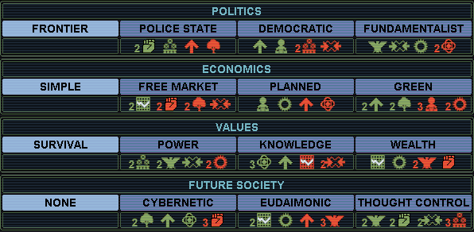

# SMACX The Will to Power mod

The Will to Power is a playing experience enhancement mod for Alpha Centauri: Alien Crossfire.  
It is built on top of Thinker mod. (Thinker mod info: Thinker_Readme.md, Thinker_Details.md, Thinker_Changelog.md).

##### Links

* [This readme](https://github.com/tnevolin/thinker-doer/blob/master/README.md)
* [Changelog](https://github.com/tnevolin/thinker-doer/blob/master/wtp_changelog.md)
* [Strategy tips](https://github.com/tnevolin/thinker-doer/blob/master/wtp_strategy.md)

## Credits

* Induktio: Created Thinker mod which greatly improves AI intelligence and makes game much more challenging.
* bvanevery: Play testing and help in design.
* dino: Play testing and alternative combat mechanics idea.

## Difficulty warning

I put this at the very top to avoid first impression frustration for those used to easily win every vanilla game on highest difficulty level.

This mod is **much-Much-MUCH** more difficult than vanilla in many ways. I strongly suggest to try it out first on **three(!)** difficulty levels below of your usual vanilla comfortable level. I also recommend lowering activity of native life from medium to lowest at first. It also plays a little differently. Your proven strategies and exploits most likely won't work and you'll need to find new ones. Yet it is still playable in same intuitive way with great visual aid to help you make decisions at every step. Later on when you accomodate to play style and AI strength feel free to crank up the difficulty for bigger challenge! :)

## Main highlights

* AI is **shokingly** smart, thanks to Induktio's work. Last game I was about to heal my damaged mindworm at a monolith so that I can later attack nearny enemy base. AI sent a unity copter 6 tiles away just to take my damaged mindworm out before it reached the monolith!
* Major revamping of unit/cost/combat system. Primary purpose is to significantly improve defense effectiveness. Attacker investments are much larger than defender ones. Building a prepared defense and deflecting enemy attacks on a frontline with minimal losses is a completely viable and economically profitable strategy.
* Major revamping in combat probability also results in more battle outcome randomness than in vanilla. It is still not that random as in Civ 1 but somewhere in between. That makes native life a real **threat**. Beware! There is no point in hunting natives for planetpearls anymore. Player should minimize native life spawning and seriously prepare to deflect worm attacks or suffer consequences. Native life acts like an opponent as it should.
* Many formulas and rules are simplified to achieve better clarity. Things are more intuitive and understandable now.
* A lot of micro exploits are eliminated. Game is more streamlined toward general competition without logically irrelevant grinding.

## Why this mod?

There are tons of interesting features in the game. Many of them are revolutionary for 4X games world. I don't think there is another so feature reach game. I **DO** want to try them all!

With great power comes great responsibility, though. The more features you have the more difficult to make them work together. A slightest change in parameters or implementation may renders any of them completely broken, unusable, strategically unviable, or shadowed by other features. It is time consuming art and craft of game testing and perfecting. There is no doubt SMACX is the greatest games of all time. It is also clear it was hastily pushed to the market to earn quick money in its unfinished form. In definitely contains quite playable core - thanks to previous Civ 1/2 play testing. However, most of new features do not compose an integral game experience. Instead they look like unframed gems scattered here and there. Their description sounds exciting but current implementation renders them unusable which is to a great sadness to all true strategical game lovers.

I have started this mod initially to myself to give such underused features and strategies a chance to shine and to increase overall game challenge and replayability. In such option reach games like SMAX variations are endless. Due to such variations some strategical choice may sometimes shine depending on current conditions. Changing strategy in response to changing game situation is the nature of the play and that's why we have many to chose from. However, there should not be options those are never (or quite rarely) viable. Such unused option would just clutter game interface and player memory. Well thought game should not have any unusable elements. In this mod I try to make all options/features/strategies viable in one way or another.

### This mod motto

Any option/feature/strategy should be undoubtfully advantegeous in some play style of game situation. Proportion of games where it provides such advantage should be noticeable too.

# Design concepts

Whenever I see some feature worth improving/highlighting these are guidelines I use to decide whether I should touch it at all and, if yes, to which extent. By default I try to not fix what is not obviously broken.

* Feature should do what it claims to. If it is impossible to make it work, such feature should be excluded. Example: Deep pressure hull.
* Feature should not outright contradict or break game concepts. Example of game concept: build-your-own-unit design workshop. Example of the feature directly contradicting this concept: mixed components (resonance armor and such).
* Game flow and features generally should be understandable to people and have clear visual effect on the game and player choices. This doesn't mean they should resemble real life. They should be only what is expected of them by average game player. There should be no hidden elements or algorithms those are difficult to grasp and apply. Example: unit cost formula. In vanilla infantry attacker 10-1-1 unit costs 5. With that in mind average player with previous Civ1/2 experience naturally would expect same strength infantry defender 1-10-1 cost the same. They would be shocked to discover that it is 20 in SMACX actually. This doesn't match player expectations.
* Game should not create an extremely overpowered or underpowered strategy. Each strategy should be viable at least at some circumstances according to this mod principles. This mod does not intent to "balance" anything but only to adjust some obvious favorite or underdog strategies. Overpowered strategy example: indestructible army.
* Being usable also means to come at the right time in research tree. Coming too early clutters game interface and takes space from other more needed features. Coming too late causes unnecessary slowdown and frustration. This mod adjusts item appearence times to match faction development level.
* Some items naturally come in sequence when each follower effectively obsoletes its predecessor. Good example is weapons and armors. This mod tries to spread them evenly on a research scale so player can enjoy each for about same time. It also tries to link their corresponding technologies to assure they appear in right order. 
* Mutually exclusive items/features are adjusted in price and effect so that they can compete with each other and none is completely inferior. Good example is social models.

# Technology tree

A lot of above changes require moving items and features up and down technology tree. Apparently, rearranging technology tree is inevitable. This may seem like a big change for users. Therefore I dedicate a whole section to explain my reasons.

Rearranging technology tree is not something unheard of. A lot of mods do it and produce quite playable experience. The trick is in accuracy and placement since handling a dependency tree is nontrivial work.

SMACX futuristicly named technologies have no roots in real scientific history except maybe Fusion Power :). This is done, obviously, on purpose to highlight a sci-fi atmosphere. Same story is with other in game concepts, items, and features. Nobody can rationally explain why technology has such prerequisites or why it allows certain game features. I agree that *some* technology-feature relations make sense but most do not. In this regard I believe fiddling with technology tree is an acceptable modding approach. One could memorize some game concepts after thousands of games, of course but I doubt this is the way to go. Most of the time I find myself browsing help to understand which technology uncover which feature. That is completely fine and that is what help is for.

I tried to minimize technology tree changes to satisfy my modding needs only and to not get highwire about it. I selected one primary feature for each technology among those it uncovers. Such primary feature is the most memorized and most important technology association. In other words, player usually researches certain technology for its primary feature. Example: Doctrine: Air Power for needlejet chassis. I firmly kept such assosiations. Everything else might change. However, I also tried to keep modified tree as close as possible to vanilla one. Technologies may float but they do not go far from where they were originally. Like Biogenetics is still early game technology while Advanced Spaceflight is still late game one. I also tried to preserve secondary assosiations whenever possible to not mix things up too much.

I think I did good job on linking technologies. Vanilla technology level quite inaccurately predict technology appearance time. My tree is built with exactly 7 technologies per level. Each technology prerequisites are exactly from two below levels. This puts a pretty good timeline and value on a technology which is a great help for technology exchange. You know right away that any level 4 technology is clearly farther up the tree than any level 3 one - no need to look them up in datalink. Now it is easy to predict relative technology appearance time by its level.

###### Note to users

I have selected primary features based on my own understanding of their importance. If someone believes there should be a different primary association - let me know. I'll gladly substitute. After all, the technology is just a placeholder for features and can be replaced or even renamed as needed.

Keep in mind that technology prerequisites are generally arbitrary and serve as interlevel relations only. Preserving some beelines is an option but not a primary concern. I welcome any suggestions about rearranging and relinking technology tree to match game lore.

# Combat related stuff

## Attack/defense ratio adjustment

Overpowered strategy: Indestructible army.  
Cost/benefit imbalance: Conquering whole planet for near zero cost investment in army reinforcement.  
Consequences: Conquering the whole world can be easily done in the mid game with minimal investments. The conquest victory become the easiest and earliest achievable. Other victory conditions almost never apply especially the ascent to transcedence. One needs to delay the victory **on purpose** just to enjoy other victory types. :frowning_face:  
Fix: adjust weapon and armor progression, attack/defense ratio, combat unit costs, military facility costs so that equally developed invader lose more units conquering enemy bases than defender and would require constant resupply to keep further advancement. In economical terms capturing a base should cost 2-3 times more in unit mineral cost to assailant than to victim. That is, of course, holds true only for attacking **prepared** defense of same technologically developed opponent. More advanced weaponry decreases player relative losses, obviously. Hefty price on conquering enemy bases makes non-stop conquering strategy not always a best choice. War related economical stagnation could be a too severe consequence for expansion.

To support the point above weapon and armor rating in this mod go 1:1 until about end of the game. The top weapon is about 20% stronger than top armor. Not that this difference is important at the end game where winner is essentially determined already. This is the point of this mod: let factions effectivelly defend themselves throughout the game and do not crack under slightest pressure in the middle ages. It doesn't stop anyone for crushing their enemies with enough dedication and skills. However, as it was already pointed earlier, such crushing comes with the price and peaceful development is a completely viable alternative to war.

###### Note to users

Large number of conventional weapon items (12) in the game presents two potential improvement areas.
One should experience war conflict in each of 12 first technology levels to enjoy each and every weapon/armor item. This is practically impossible and, therefore, big part of weapon/armor items is inevitable unused. It does not contradict my principle as each one can still be used over the course of multiple games. Yet, if anyone believes there are too many of them, I can reduce number of weapons to 8 or something.

## Weapon and armor value progression

Weapon and armor strength progression was redone to resemble Civ 1/2 slow slow proportional growth. Indeed, I cannot imagine why developers would left such weird weapon strength progression as 2-4-5 (?) or 12-13-16 (?) :confused:. Whereas it is completely easy to correct it to normal growing progression by just changing text configuration. I've adjusted other weapon strenghts too to smoothen overall strength progression. Each next level item is about 25% stronger starting from value 4 onward.

Vanilla game has very weird code that selects regular conventional weapon icon based on its offensive value. There is nothing like that for any other item types (non regular-conventional weapons, armor, chassis, ability). Very precise, specific, and meaningless piece of programmatic machinery.
This is fixed now. Modders are free to set any offensive values to regular conventional weapons without breaking their respective icons! Woo-hoo, thanks to me.

With this in mind I was able to correct weapon strenght progression to smooth it while keeping proper icons for each weapon.
Here is the current game weapon and strength progression by technology levels. There are less armor items in the game so they do not appear every research level at second half of the game. When they appear they match same level weapon strength.

| Level | Weapon strength | Weapon cost | Armor strength | Armor cost |
|----:|----:|----:|----:|----:|
| 1 | 1 | 1 | 1 | 1 |
| 2 | 2 | 2 | 2 | 2 |
| 3 | 3 | 3 | 3 | 3 |
| 4 | 4 | 4 | 4 | 4 |
| 5 | 5 | 5 | 5 | 5 |
| 6 | 6 | 6 | 6 | 6 |
| 7 | 8 | 7 |  |  |
| 8 | 10 | 8 | 10 | 8 |
| 9 | 13 | 10 |  |  |
| 10 | 16 | 12 | 16 | 12 |
| 11 | 20 | 14 |  |  |
| 12 | 24 | 16 | 24 | 16 |
| 13 | 30 | 20 |  |  |

## Combat mechanics

### Round odds fix

Vanilla random roll method resulted in incorrect combat round odds. This is fixed now. Round odds are now proportional to unit corresponding strengths as it should be. :wink:

### Battle outcome skew fix

Vanilla multiround combat model generates extremely narrow skew for combat outcome. Strength ratio of 2:1 (twice stronger attacker) produces 14:1 battle winning odds which is almost guaranteed kill. Since there are plenty of 50% and 100% bonuses in the game it quite common to observe significant strenght ratio variations. Together with inequality in weaponry research and other game variations strenght ratio may easily fluctuate between 1:4 and 4:1. Yet, as we just saw any investment into strength improvement beyond 2:1 is a complete waste.

This mod introduces alternative combat mechanics that smoothens that skew by reintroducing some randomness into combat outcomes. Now strenghtening units by all means keeps paying off up to 4:1-5:1 ratios. Anything beyond it is still an almost guaranteed kill as it should be.

### Odds confirmation dialog fix

Odds confirmation dialog now displays correct winning probability percentage. Vanilla odds numbers look cool but are highly unusable without calculator not even mentioning they are incorrect to begin with.

## PLANET rating effect on combat

Native warfare seems to be everybody's weapon in vanilla. It doesn't seem fair to PLANET oriented factions. In base game PLANET rating is very weak comparing to say INDUSTRY/RESEARCH. It should be at least comparable to justify Cult of Planet's -1 INDUSTRY penalty. In my mind even ±1 PLANET rating should be *very* noticeable. Therefore, this mod increases its combat bonus to 15%. It also applies it on both attack and defense so PLANET haters suffer significant penalty. Now running Free Market really forces player to build up anti native base defense - mere avoiding combat is not a good strategy anymore.

On top of that this mod sets land psi combat base odds to 1:1. This way PLANET rating controls advantage/disadvantage in psi combat, correspondingly. It also brings psi attack odds against Transe unit in base (1:2.25) in range with conventional attack odds against base with PD/TF (1:2 - 1:3). This last change, though, could be undesired for many players as I found out already. Luckily, it is configured in alphax.txt. So anyone can roll it back or set to any other preferred value.

## Base intrinsic defense and defensive structures

Base intrinsic defence raised to 50%. This is configurable in alphax.txt. Unit in base protected weaker than on rough terrain does not make sense as it forces defender to step outside of the base to get better defense.

Base defensive structures (Perimeter Defense, Naval Yard, Aerospace Complex, and Tachyon Field) defense bonuses are exposed in thinker.ini. First level structures defense bonus is left 100% as in vanilla. That effectivelly adds 50% on top of intrinsic defense. Second level structure (Tachyon Field) defense bonus is +50% to match first level bonus increase and to avoid late game overdefence that is many modders major concern.

| Defense structures | Cumulative bonus | Cumulative multiplier |
|----|----:|----:|
| No structures | +50% | 1.5 |
| Level 1 | +100% | 2.0 |
| Level 2 | +100% | 2.0 |
| Level 1 and Level 2 | +150% | 2.5 |

## Fanatic attack bonus

Believers are quite narrow focused faction. Their SUPPORT and Fanatic attack bonus makes them powerful large army warfare machine. This is what they **should** be doing to succeed as they suck at everything else with their RESEARCH and PLANET penalties. Surprisingly, their attack bonus is not that remarkable. Even Usurpers are better with their +25% attack bonus as they apply it to all type of combat including psi. Since believers are pathetic in psi combat their conventional attack bonus should be at least greater than Usurpers'. Assuming that even in the best circumstances they are not going to be in permanent war state raising their attack bonus to 50% is not at all overpowered. This is a compensation for their poor economical development.

## Alternative artillery damage

Vanilla artillery damage is proportional to weapon/armor ratio *rounded down*. That means artillery cannot even harm too tough opponent above certain threshold. For example 2 strength artillery **cannot possibly** harm 3 armor strength unit anywhere in vanilla! That is completely ridiculous as the primary artillery purpose is to soften tough opponents before hand-to-hand combat.

This mod introduces a small correction to the game formula when the above ratio is below 1. Instead of doing zero damage artillery have a chance to do 1 damage proportional to attacking artillery strenght. It is a logical fractional continuation of original whole number formula.

Additionally artillery damage is multiplied by attacker firepower to ignore defender reactor power as it is done for hand-to-hand combat as well.

## Repair rates

Repair rates are lowered to eliminate fast and instant healing. Parameters are configurable.

| Location/Facility/SP | Repair rate, per turn | Maximal repair level |
|----|----:|----:|
| Field | 10% | 80% |
| Base/bunker/aribase | 10% | 100% |
| Conventional unit in base with corresponding land/sea/air repair facility | +10% | 100% |
| Native unit in base when faction owns SP for fast native repair | +10% | 100% |
| **Anywhere** when faction owns Nano Factory | +10% | 100% |

## Morale

[Treatise on Morale](http://alphacentauri2.info/wiki/Treatise_on_Morale)

The article above is a good example of what we are dealing with here. An excellent scholary research explaining miriads of small SMACX morale releated features and their interdependencies. A lot of enthusiasts worked a lot of man-months to disassemble, reverse engineer, and deliver this sacral knowledge to us in more or less orderly fashion. Even after all these efforts mere reading this article and trying to comprehend all intricacies of game engine is a work in itself. I personally sometimes have to read passages few times to catch the idea and details.

Undoubtfully, such complicated rules should not even exist in a game in a first place for players' sake. And if they do they should be clearly explained with every detail at least in advanced help. Apparently designers realized that such help would take like 20 pages of in game text. That could scare beginners! Better to replace it with one-two vague sentences or not mention it at all. Clarity achieved = profit! In literal meaning. :smile:

Now players need to disassemble game to understand why their units have unexpected morale. Ugh. :unamused:

### Children Creche morale bonuses

#### Removed home base Children Creche morale bonus

Reason: undocumented.

#### Removed stationning base Children Creche morale bonus

Reason: undocumented.

Some may refer to this passage from Datalinks: "All negative MORALE effects are cancelled for units in base square; instead such units receive a +1 MORALE modifier." It is hardly a documetation for such complex mechanics. See [Treatise on Morale] at the top of Morale section.

### Very Green defense bonus

Designers added tons of little trinkets for player so they don't feel sorry for themselves and don't stop playing game in first few turns. As important as it is for absolute newcomer this is a pure annoyance to a seasoned player who doesn't quit just because they don't see a measly bonuses everywhere they look.

One of such nonsense bonuses is a Very Green defense bonus effectively turning it into Green on defense. I absolutely welcome any number of independent means to raise/lower morale in addition to base unit morale levels. However, assigning a special bonus to the very basic morale level that effectivelly disables its intended effect (even if on defense only) is beyond my comprehention.

### Promotion probability

[Vanilla formula disassembled](http://alphacentauri2.info/wiki/Treatise_on_Morale#Reverse_engineered_Battle_Upgrade_formula)

Surprisingly, the vanilla formula is very sensible. Essentially, promotion odds are proportional to opponent to victor strength ratio as well as to how badly both you and opponent got damaged in battle. The only problem with it is that Very Green and Green units skip this calculation and are always promoted. That opens a pandorra exploit box as player can wind down their MORALE rating to lower their units morale and then quickly acquire 1-2 promotion levels.

I decided to even out promotion probabilities across all levels to decouple from MORALE rating jumping up and down. Now all probabilities are same as for Commando->Elite promotion. For example, when two equal units fight they both have 50% chance to win and then victor has 25% chance to be promoted.

Besides, why promotion should be easier for lower morale levels? That benefits weak morale factions. It should not. They have low morale for a reason. It most likely a flip side of having some other good benefit either innate or SM induced. The combination of bonuses and penalties is already carefully thought of by faction/SM designers. Why game thinks it knows better and aid to these poor "weaklings" as it percieves them?

## Territory combat bonus

I was struggling to make defense economically more effective than assault. Ideally defending should be two to three times cheaper than assaulting. Equalizing contemporary weapon and armor strength was a step in that direction. It was not enough. Attacker still can bring fight odds at 1:1 with greater numbers and artillery superiority against base garrisons behind PD. I do not count sensors as they are easily destroyable and not of great help. Outside of bases aggressor has full control of the land: penetrates deeply beyond frontline, kills formers, destroys enhancements, destroys sensors, cuts reinforcement communications. I was thinking about giving defender a direct bonus: pertained to defending of own territory explicitly, permanent, indistructible, undeniable.

Then it struck me. The *explicit* territory combat bonus is the perfect solution for that! :star2: It is inherent so everybody always has it and it cannot be cancelled. It kicks in only on own territory combat. Due to its inherent nature it helps defender even in case of poorly prepared defence. It effectivelly replaces Chidren Creche and Sensor Array bonuses. Unlike them, though, it applies on whole territory not only in bases which is much better representation of defensive war. Why on earth the rest of the territory should be any less protected?

Children Creche and Sensor Array lose their combat related bonuses. I think it is to the best. Children Creche affecting morale was pretty strange idea in first place: too powerful for cheap facility, too cumbersome to understand the logic (only negative MORALE SE), too limited (bases only), buggy implemented, difficult to read/understand in unit screen. It should concentrate on its primary purpose: growth and efficiency. They are already quite powerful capabilities.

Building sensors to extend protection bonus is nice idea but they are easy to destroy with single artillery shot or with Needlejet raid or with probe accompanied by combat unit. They are so easy target that it is considered stupid to storm base without destroying them fist. This effectively nullifies their defense bonus value. We can set their bonus to 100% and it is still equals to zero when they are gone. Therefore, I've decided to remove their defense bonus altogether and keep them as observation stations which is still quite useful tool for human player.

Summarizing the above, territory combat bonus (both attack and defense) is a nice replacement for Children Creche and Sensor Array combat bonuses but more logical, simpler, more understandable, move visual. It is also displays properly in combat calculation screen with own explicit name and bonus value (Territory +50%) which is much better than the train of yet to be deciphered pluses. It works equally on land and sea. Finally, the undervalues sea battles are taken care of. From game lore side one can visualize this as troops fighting 50% stronger on mother land/sea. Neat! How simple and logical is that?

# Unit cost

Unit cost formula is reworked and is greatly simplified to resemble Civ 1/2 model. Now it is **MUCH** easier to understand this. For example, both 6-1-1 and 1-6-1 infantry units now cost 6 rows of minerals. Imagine the simplicity! New formula completely removes a quadratic armor cost growth problem. High end mixed inrantry units now cost comparable to speeder and fully armored foil units are comparable to hovertank.

## Reactors

Reactor power does not multiply unit max hit points anymore. All units (conventional and native) have 10 max hit points regardless of reactor.

Instead each subsequent reactor decreases unit cost by approximately 20%. Player gets refund when upgrading unit to cheaper one with more powerful reactor.

## Unit pricing principles
* Primary item (most expensive module/weapon/armor item) defines base cost.
* Secondary item (least expensive module/weapon/armor item) increases cost just slightly to encourage mixed units usage.
* Faster chassis make unit proportionally more expensive. Speeder/Foil are 1.5 times and Hovertank/Cruiser are 2 times more expensive than Infantry.
* Stronger reactors decrease cost by 20% comparing to previous generation.
* Abilities have now proportional and flat cost components those can be set independently for each ability. Proportional one works as in vanilla and increases cost by 25% for each unit value. Flat cost adds given number of minerals rows to the cost.

## Unit cost formula

<pre>

unit cost = [PI cost + (SI cost - 1) / 2] * reactor factor * abilities factor + abilities flat
(rounded normally)

PI (primary item) = most expensive module/weapon/armor
SI (secondary item) = least expensive module/weapon/armor

reactor factor = reactor cost / Fission reactor cost

abilities factor = (1 + 0.25 * (ability1 proportional value + ability2 proportional value))
abilities flat = ability1 flat value + ability2 flat value

</pre>

### Special formula cases for non combat units

1. Colony/Former/Supply on foil/cruiser costs same as if on infantry/speeder.
2. Reactor doesn't change Supply cost.

Here is the reason for #2. Each subsequent reactor reduces unit cost by ~20%. That is like 20% production increase for buiding units. Supply unit harvesting resources is more like a part of production infrastructure rather than part of disposable unit pool that needs to be constantly replenished by the mean of this same production infrastructure. It already has a precisely computed cost to outweigh benefits. Moreover, resources it brings home are multiplied by other facilities increasing its value further into the game. If anything Supply cost should grow with game progress but not fall. Reactors have nothing to do with Supply primary purpose: mineral harvesting. As such they should not affect it in any way.

## Weapon and armor cost

Weapon and armor cost grows slightly slower than their value. That makes stronger weapon/armor more cost effective against stronger opponent. However, it is still cheaper to build weaker units when top item is overkill.

## Non combat modules cost

Colony now costs 6.  
Cheap colony pod allows fueling expansion with nutrients excess only and ignores any economical development whatsoever. Nutrient reach faction keeps stamping colony pods and fills up all available space exponentially. Not surprisingly, such simple strategy is also a most effective way to get economical advantage early in the game. Higher colony pod price put expansion speed in check of both nutrients and minerals production encouraging early terraforming and development. Now player needs to invest into base growth and terraforming in order to expand faster.

Former now costs 4.  
Cheapest of all non combat units. There is no much sense to lower it down even more as it screws abilities cost multiplication.

Supply now costs 12.  
Harvesting resources by crawler is a very lucrative investment. Harvesting 4 minerals from rocky mine pays for vanilla crawler in 7.5 turns! Then it delivers 4 minerals each turn. That is just insane ROI. I suggest to price it as high as 120 minerals which brings its effectiveness closer to Genejack Factory. Even at this price it is still quite useful but it is not a single ultimate strategy anymore. You would think thrice if you want to build a crawler just to extract 2 units of production.

## Native units cost

Native warfare should be slightly worse to conventional as they have other benefits. They ignore base defensive structures. They are naturally both full scale attacker and defender. Their price is fixed and is much lower comparing to fully equipped top level attacker-defender units. They do not require prototyping. IoD can transport. Sealurk can attack shore units. LoC does not need refueling and can capture bases. They all can repair up to 100% in fungus squares. They do not require maintenance while in fungus square. All together they are no-brainer units and as such should be a little less effective to not become a superior choice. I've increased most native unit cost except spore launcher to encourage its use for bombardment.

# Unit hurry cost and unit upgrade cost

Unit hurry cost formula always puzzled me. Why make cost grow quadratically to become exorbitant for higher end units? The upgrade cost is, on the contrary, quite low allowing "Building SP with upgraded crawler" exploit. I decided to simplify and flatten both of them for simplicity and to prevent abovementioned exploit.

In this mod unit hurry cost is for times its mineral cost. The base upgrade cost now is an exact difference of new and old units hurry cost! Could anyone imagine game design could be that simple and transparent? :rofl:

Since higher reactors now do nothing but decrease unit cost player also gets **REFUND** when upgrading to cheaper version of unit with higher reactor. How more fairer could it get? :smile:

## Hurry cost penalty thresholds

This mod removes all hurry cost penalty thresholds. I never could grasp their strategical meaning since they do not affect course of the game but only add annoyance and require use of calculator. Let me know if anyone thinks they need to be kept.

Now all hurry costs are flat x2 for facilities and x4 for units and projects.

# Facilities cost/maintenance

Cost in mineral rows

Base facility | Cost | Maint | Explanation
------------- | -------------------:| -----------:| -----------
Command Center | **6** | 2 | This morale boosting facility increases combat effectiveness of land units by 25% which is probably the majority of all units at early age. That translates to 25% stronger army which is otherwise equivalent to 25% production bonus while forging units. It's like +2 INDUSTRY even if for land units only. Taking in account the average combat unit cost of 4+ raising the morale improvement facility cost to the price of 1-2 combat units is not at all excessive. Vanilla cost of 4 is too cheap and makes the building of this facility a no-brainer. With increased cost it will present a choice.
Naval Yard | 8 | 2 | Reverted to vanilla values. Same reason as for Command Center.
Aerospace Complex | **12** | 3 | This facility is conceptually same as Naval Yard. However, there are more air units in a game. Plus this facility also provides multiple other benefits like doubling space resource income, preventing airdrops, etc. Very useful facility should cost a little more than similar sea based one.
Bioenhancement Center | **20** | **5** | Super generic facility that boost *all* units morale up to Commando. Should be priced at least close to raw sum of individual triad facilities.
Energy Bank | **6** | | Cost is reduced slightly for this and three below facilities. They seem to be a pretty interesing facilities not getting build early because of their price.
Network Node | **6** | | 
Research Hospital | **9** | | 
Nanohospital | **18** | | 
Biology Lab | **4** | **0** | Unattractive facility with fixed income. I don't see much sense in paying a fixed maintenance for fixed income. What, you pay one energy to get two labs - what's the point? In this mod it has no maintenance and cost is slightly reduced. This gives player incentive to build it before Network Node.
Geosynchronous Survey Pod | 16 | **2** | Dropped maintenance since this is defense helping facility. I rarely use it myself. Maybe with lower maintenance it'll be more attractive.
Aquafarm | **12** | **2** | This is the most beneficial facility out of three aquatic yield improvers. It affects all work squares and not only half as other two. Besides, nutrient surplus is the most powerful resource that in time compensates lack of two others due to population growth and increase in workers. I think the above increased price is not even enough to compensate for it but 12 rows is already quite high for early game.
Brood Pit | **12** | **3** | As lolada pointed out here http://alphacentauri2.info/index.php?topic=21359.msg125058#msg125058, the combined features of this facility make it an awesome native warfare oriented aid on top of extra policae rating. Its cost/maint should be much bigger to compensate it.
Hab Complex | 8 | **0** | I just recently realized it has maintenance. Water and sewer does require maintenance in real life but there is no point to maintain it in game where it is *forced* on *everybody*.
Habitation Dome | 16 | **0** | Same as above.

# Secret Project costs

Increasing cost of SP to make AI build it longer so that other AI and human can compete longer for them and less research advanced factions can still get some of them.

I also clearly understand that exact SP cost is not that relevant. It easily can be moved 50% up or down and nothing changes much in the game. My main concern was their way to low cost in vanilla. I feel like they should be about 2-5 times more expensive based on benefits. Other than that I welcome your suggestions.

#### General pricing rules

##### SP replacing facilities those are beneficial in every base (The Planetary Energy Grid)

 10 \* <facility cost in minerals> + 100 \* <facility maintenance in credits>

##### SP replacing facilities those are beneficial in every base (The Command Nexus)

Same as above but reduced by some arbitrary usability factor.

##### SP providing tangible benefit (The Human Genome)

100 \* <facility benefit in energy>
200 \* <facility benefit in minerals>

##### SP with unique abilities (The Xenoempathy Dome)

arbitrary

## SP cost table

Cost in mineral rows.

secret project | level | cost | explanation
----|----:|----:|----
The Merchant Exchange | 1 | 20 | Local improvement - no change.
The Human Genome | 2 | 40 | 2 minerals worth quelled drone x 200
The Command Nexus | 2 | 40 | 60 cost x 10 + 1 maintenance x 100. Reduced in half as it is not needed in every base.
The Universal Translator | 2 | 40 | Pretty limited usage of two technologies advancement. There are no unlimited artifacts in a game. No change.
The Weather Paradigm | 3 | 60 | Tough to evaluate. Great boost to the faction via advanced terraforming but advantage doesn't last whole game. Should be most expensive in its time.
The Empath Guild | 3 | 60 | Way to Governorship and energy income multiplier. Should be quite expensive.
The Living Refinery | 3 | 40 | About 2 minerals per base per turn x 200.
The Virtual World | 4 | 60 | 60 cost x 10 + 2 maintenance x 100. Reduced slightly by user requests.
The Planetary Transit System | 4 | 40 | Drone quellying + immediate growth boost. Proportional to empire size but limited to small bases only. Slight increase.
The Maritime Control Center | 4 | 60 | 80 cost x 10 + 2 maintenance x 100. Reduced in half as it is not needed in every base.
The Planetary Datalinks	| 5 | 60 | Again pretty vague but should be quite high priced since technology advantage is everything in this game.
The Manifold Harmonics | 5 | 60 | Powerful fungus production. However, advantageous for high PLANET rating only and fully develop only in later game.
The Planetary Energy Grid | 5 | 60 | 60 cost x 10 + 1 maintenance x 100.
The Citizens' Defense Force | 6 | 40 | 50 cost x 10. Reduced slightly as it is not needed in every base.
The Xenoempathy Dome | 6 | 40 | Tactical advantage, aid to fungus terraforming, +1 lifecycle = slight increase.
The Supercollider | 6 | 30 | Local effect = no change.
The Ascetic Virtues | 6 | 60 | +POLICE + growth = slight increase.
The Theory of Everything | 7 | 40 | Local effect = no change.
The Hunter-Seeker Algorithm | 8 | 60 | No clue how to deal with this. People tend to value it quite high. Doubled the price.
The Nano Factory | 8 | 40 | Slight tactical and unit upgrade advantage. Nothing seriosly game changing. No change.
The Longevity Vaccine | 9 | 60 | Drone quellying. Slightly higher valued than The Human Genome due to more advanced era.
The Nethack Terminus | 9 | 60 | Some help to probe teams. Other than that nothing much.
The Neural Amplifier | 10 | 80 | Tough to evaluate but I tend to price combat effectiveness boosting projects quite high.
The Pholus Mutagen | 10 | 60 | Allows higher production without ecology impact. Should be slightly more expensive.
The Dream Twister | 10 | 80 | Same as The Neural Amplifier.
The Cloudbase Academy | 10 | 120 | 100 cost x 10 + 3 maintenance x 100. Not reduced at all as AC is needed in every base for satellites later on.
The Cyborg Factory | 11 | 120 | 200 cost x 10 + 5 maintenance x 100. Reduced in half as it is not needed in every base.
The Clinical Immortality | 11 | 120 | Drones and diplomatic victory. Should be quite high.
The Singularity Inductor | 11 | 200 | 200 cost x 10.
The Bulk Matter Transmitter | 11 | 200 | 10 minerals x 200.
The Network Backbone | 12 | 160 | Large source of labs multiplied by the number of all world bases. Very high.
The Self-Aware Colony | 12 | 200 | Roughly 20 maintenance x 100.
The Space Elevator | 12 | 100 | Production boost for satellites. The boost itself is limited but satellites are the most lucrative facilities in the game. Priced high.
The Cloning Vats | 13 | 300 | Endless population boom. It is the most expensive SP in my mod (besides AtT).
The Telepathic Matrix | 13 | 200 | Total drone solution. About 5 times The Human Genome cost. 
The Voice of Planet | 14 | 120 | 
The Ascent to Transcendence | 14 | 300 | End game bases with crawlers should be able to build it in reasonable time but not instantly.

# Feature appearance time

Foil is available to be researched at start. Other modders said much about that already.

Network Node, Energy Bank: moved to level 3.  
These facilities are not effective at the beginning. Even with 20 raw energy yield they contribute 5 labs/energy = 2.5 worth of minerals and break even time is 32 turn. Only averagely beneficial and you need to get your first bases at 20 energy yield first.  
After some playtesting I think they could be moved to level 4. I rarely start building them immediately upon their discovery. They are not that immense critical nor they are super beneficial at the time.

Habitaion Dome: moved to 50% in research tree (was 75%).  
I often struggle to get it when needed. It's too far in the future.

Non-lethal methods: moved to 75% in research tree (was 50%).  
Doubling police power should not come too early.

Bioenhancement Center: moved to 75% in research tree (was 50%).  
Generic facility should come after all specific ones.

Hybrid Forest: moved to 70% in research tree (was 50%).  
Not needed immediatelly after Tree Farm. With its price nobody is going to build it right away.

Satellites: moved to 80%, 85%, 90% in research tree (were somewhere at 60-70%).  
Game breaker goes to the very end. Discussed many times by other modders.

The Living Refinery, The Manifold Harmonics: relatively weak SPs moved earlier.

Reactors are on level 3, 6, 9, correspondingly.  
It seems that unit cost reduction is most useful earlier when production power is low. Later on it becomes less relevant. Early Fusion reactor fuels further expansion.

# Social engineering

This mod treats a combination of SE choices as an option, not a single SE model in isolation. It also doesn't try to "balance" SE models between each other but rather distribute SE effect changes across models to conveniently provide all the spectrum of possible SE effect ratings making all of them reacheable. I have devised a model to "compare" SE effects average value to each other with certain degree of assumption. Even though they can be "compared" to each other it is obvious that their use varies greatly during the course of the game and depending on circumstances. They had to be weighed based not only on their average value but on the other game related factors.

As always, I tried preserve social effects set whenever possible so vanilla SMs stay recognizable. Apparently, UI cannot display more than 4 effects per model. So that was another hard restriction for this reengineering project. I tried to use up to 4 effects wherever possible to maximize effects usage and maximize variety of their ratings.

I timed them on research line so that first row of SMs comes at level 2, second at level 3, third at level 5 and fourth at level 7 which is about when 50% technologies are researched. This is somewhat earlier that in vanilla when you got last SE row at about 75% throughout the game. Certainly future society SMs are powerful but it is kinda useless to acquire them at the game sunset.
In accordance to this timing I tried to focus on most important effects at the time of appearance. Early models emphasize TALENT, SUPPORT, POLICE, GROWTH. While later models favor ECONOMY, EFFICIENCY, INDUSTRY, RESEARCH. Not necessarily exactly like this but as a rule of thumb.

ECONOMY and EFFICIENCY are by far the strongest effects. I tried to equalize their positive and negative impact wherever possible. Some people complained that I give by one hand and take by other. Well, sort of. I don't want Democracy-FreeMarket-Welth combination to rule the world. You want to play it over and over and over again - there is vanilla out there. I had my share and now I seek for more variability. You want to throw all goodies at a single SE choice - go ahead and be your own guest. I want a variety of option I can weigh and corretly apply to ever changing game situation instead. If you don't like the fact that some SE choices are not insanely overpowered - you probably shouldn't play my mod. See the mod goal at the very top.

ECONOMY changes are mostly positive in original. Even though negative effects are not that interesing I still added some negative ECONOMY changes here and there to outweigh positive changes in other SMs.

POLICE scale is assymetric and shifted toward negative values. The true middle point is at -1 rating. In vanilla game everybody essentially starts with inherent +1 rating above the middle point. Moreover, everybody can build Brood Pit to get +2 POLICE later. That is too much inclination toward positive values which results in need of enourmous negative changes for some SE models like FM in vanilla. This mod tries to avoid this by subtracting 1 POLICE from ALL factions shifting starting position to where it should be. This allows applying positive and negative POLICE changes equally across SE choices.

GROWTH is very restricted on negative side. Just -3 rating halts base growth completely which is a pretty strong effect. On the other side of the spectrum +6 rating triggers population boom which is another pretty strong effect. It is a common concern of all modders to limit population boom. In this mod it is attainable by Children Creche + SE + golden age. However, it is not attainable without golden age. One need to pour some amount of gold on people to make them happy and produce more children. Same as in old good Civ 1/2.

MORALE had a balanced scale by itself but morale facilities can easily raise unit morale even beyond what highest MORALE rating would do. That effectivelly renders high MORALE values useless. As such I do not use too many MORALE modifiers across SE choices. SE provides +2 MORALE max only.

About the same story with PROBE and Covert ops center. Even though it is just one +2 facility the PROBE scale is shorter as well. SE provides +2 PROBE max only.

# Terraforming and land improvements

## Yield restrictions

This is another feature I cannot understand. What good does restricting yield do? Why I cannot farm a rainy tile to boost my base growth a little? Why I cannot mine a rocky tile to get myself some minerals? In vanilla game these restriction are lifted when you discover advanced terraforming. At this time I don't need a rocky mine anymore since borehole is better. As the result I never build mines to work on - only to harvest by crawler. I don't know how to disable them completely so I moved them all onto level 1 technologies.

I guess this was a blind copy of Civ 1 Despotism restrictions. Despotism reduces any factor of production by 1 where you have 3+ of such production. However, this was compensated by unit production and settler food supports. Meaning you harvest less but you spend less on support too. SMACX lost this second part separating support into its own effect. Thus leaving this nicely thought and designed element half cut and stupid looking. :angry:

## Forest

Many people before me mentioned overpowed forest. Indeed, it is capable of turning dry and barren 0-0-0 terrain into 1-2-1 adding 4 resourses in 4 turns with combined yield comparable to rocky mine. It is just insane terraforming effectiveness. As if this is not enough it spreads by itself = zero further investments. It is pretty nice option for poor bases but it should cost more than mine to be not the-only-viable-option. Currently I set its terraforming time to 12 and reduced yield to 1-2-0 to make it just enough helpful option for barren land bases but not too much to beat rocky mine.

## Fungus production

Fungus production is not some crucial part of the game. However, it is still some alternative yield source that is mostly overlooked due to very slow development comparing to conventional terraforming. I'd like to add few touches on it.

### Fungus production guidelines

Get it to at least 1-1-0 yield relatively early in the game to allow minimal support for barren land and sea bases.
Focus on energy yield in the mid game to compliment forest instead of competing with it.
Use green/alien technologies for fungus production to streamline research priorities for green/PLANET factions.

| technology | level | fungus production | cumulative yield | comment |
|----|----:|----|----|----|
| Centauri Ecology | 1 | +1 nutrient | 1-0-0 |
| Progenitor Psych | 1 | +1 energy | 1-0-1 | reassigned |
| Field Modulation | 3 | +1 nutrient | 2-0-1 | reassigned |
| Bioadaptive Resonance | 4 | +1 energy | 2-0-2 | reassigned |
| Centauri Psi | 5 | +1 nutrient | 3-0-2 |
| Centauri Meditation | 6 | +1 energy | 3-0-3 |
| Secrets of Alpha Centauri | 9 | +1 nutrient | 4-0-3 |
| Centauri Genetics | 10 | +1 energy | 4-0-4 |

## Sea Sensors

Introduced *Sensor Buoy* on sea similar to *Sensor Array* on land. Copied from SMAniaC mod. They do not confer defense bonus but they increase visibility which is very important to track fast moving ships in your territory and around.

# Other changes

## Special weapon and armor

Disabled all hybrid and psi items.

I really cannot grasp this concept. Why having half strength ability while you can attach fully powered one for the same price? Besides, mere melting ability to the item breaks the unique SMACX unit workshop build-it-yourself paradigm! Why to introduce constructor tool and then provide pieces those cannot be disassembled to elementary properties. I almost never use them for their added ability. Merely like another regular piece of equipment. And now in my mod they don't exist anymore and nobody cries.

Same story with psi weapon and armor. By the time you get them you have full spectrum of natives who are much cheaper than psi attack + psi defense unit. I personally never used them. Anybody does? Let me know if you think they are valuable assets.

## Removed abilities

Cloaking device and Deep pressure hull abilities are broken by game shared map implementation. Other people said enough about it. Disabled them.

Repair Bay ability is useless in my mind as well. I cannot even imagine where would you massively transport wounded units.

Soporific Gas Pods. People reported AI doesn't use them due to the bug. I think it would be fair not to give them to humans too until this is fixed.

## Aquatic faction +1 mineral advantage

I was able to remove AQUATIC +1 sea mineral advantage. Now they are back to normal and expected growth. They will be slow on start but they have 50-100 years of undisturbed development. Once their old bases are developped enough to stamp sea pods they explosivly expand but then other factions start barraging waters and set their sea colonies. Seems to be a good balance. However, aquatic factions still develop quite differently. That requires a lot of play testing.

## Disabled probe morale boosting technologies

Some vanilla technologies boost probe team morale for free. That makes all new probe teams elite toward the end of the game. Err, what's the point in that if everybody gets it and this renders Covert Ops and PROBE ratings useless for probe team morale? I removed all such flags. Technologies do not improve probe team morale any more.

## Removed planetpearls energy reserve bonus

Planetpearl is a pretty weird bonus that player gets when killing land only natives (not sea, not air). This bonus goes from 10 to 70 based on killed unit lifecycle. Attacking unit with 3:2 strenght advantage has pretty good winning chances. That least to harvesting Planetpearl exploit when player induces natives appearance by trying to enter fungus tile on purpose. Gameplay wise I percieve it as gold coins falling off defeated monsters in Mario. Purely arcade element quite strategically disconnected from the rest of the game and very distracting. Native lifeforms should be percieved as a threat not as a treasure.

## Territory distance from sea and coastal bases

SMACX introduces a brilliant concept of a territory. Now no one can stick their own bases in between other faction bases. This prevents a constant micromanagement of shooing **friendly and especially ally** colonies from your territory. It also lets player more high level control of keeping other faction units far enough from your bases. It is a definite playability improvement.

Interestingly that when SMAXC treats land and sea bases equally (which is an epic feature by itself) the sea territory borders do not extend from sea bases as much as on land. Essentially they fail to secure territory even in between already placed sea bases which is a primary purpose of the territory. It also doesn't serve secondary purpose of the territory to keep other faction sea units at bay. Sea units move fast and 3 square extended borders is just a one turn cross distance. The situation with coastal bases is even worse. They extend their sea border 1 square away. It is just ridiculous. It doesn't prevent other players to place sea colony just 2 tiles away denying **ALL** water resources to coastal base. It is a major complaint of may players.

This mod equalizes border extension distances between land, sea, and coastal bases. Even though I believe this is a must have feature the configuration parameter is still in thinker.ini in case anyone wants to switch it off.

## Heavy Artillery and Air Superiority cost

These abilities do not improve unit properties directly. Instead they essentially create completely distinct unit type with its own ins and outs. These unit type strengths are controlled by its own settings in alphax.txt. Damage Numerator & Denominator for Heavy Artillery and Combat bonus/penalty for Air Superiority. Their non-zero cost is confusing as if these abilities worth something by themselves. I think it is much clearer to keep them zero and allow player to convert unit type without additional penalty.

# UI changes / cosmetics

## Battle computation display

Adjusted summary strength and power lines to the bottom in battle computation display. This way it is easier to read and compare them between attacker and defender.

## F4 screen lables

Shortened some labels in F4 screen to fit longer base names and avoid line wrapping.

# Appendix

## Technology feature associations

Feature associations change quite often. This may be stale information.

|Type|Feature|Technology|Level|Primary|
|----|----|----|----:|----|
|1 unit types|Foil chassis Troop transport  Pressure dome|Doctrine: Flexibility|1|Yes|
|1 unit types|Speeder chassis|Doctrine: Mobility|1|Yes|
|1 unit types|Heavy artillery|Polymorphic Software|2|Yes|
|1 unit types|Probe teams|Optical Computers|3||
|1 unit types|+ Foil Probe Team|Optical Computers|3||
|1 unit types|Mind Worms|Centauri Empathy|3|Yes|
|1 unit types|Spore Launcher|Bioadaptive Resonance|4|Yes|
|1 unit types|Supply transport|Industrial Automation|4||
|1 unit types|Sealurk|Centauri Psi|5|Yes|
|1 unit types|AAA Tracking|Advanced Military Algorithms|5|Yes|
|1 unit types|Cruiser chassis|Doctrine: Initiative|6||
|1 unit types|Isle of the Deep|Centauri Meditation|7||
|1 unit types|Needlejet chassis  Air base|Doctrine: Air Power|7|Yes|
|1 unit types|Hovertank chassis|Nanominiaturization|8|Yes|
|1 unit types|Copter chassis|Mind/Machine Interface|9|Yes|
|1 unit types|Missile chassis|Applied Gravitonics|10||
|1 unit types|Locusts of Chiron|Centauri Genetics|10|Yes|
|1 unit types|Fungal and tectonic payloads|N-Space Compression|10||
|1 unit types|Gravship chassis|Graviton Theory|11|Yes|
|1 unit types|Planet Buster payload|Orbital Spaceflight|11||
|1 unit types|orbital insertion|Graviton Theory|11||
|2 ability|Hypnotic trance|Secrets of the Human Brain|2|Yes|
|2 ability|Comm jammer|Information Networks|3||
|2 ability|Empath song|Bioadaptive Resonance|4||
|2 ability|Fungicide tanks|Synthetic Fossil Fuels|4||
|2 ability|Amphibious pods|Doctrine: Initiative|6||
|2 ability|High morale|Intellectual Integrity|5||
|2 ability|Deep radar|Advanced Military Algorithms|5||
|2 ability|Air superiority|Doctrine: Air Power|7||
|2 ability|Soporific Gas Pods||||
|2 ability|Polymorphic encryption|Pre-Sentient Algorithms|8||
|2 ability|Marine detachment|Adaptive Doctrine|8|Yes|
|2 ability|Algorithmic Enhancement|Nanominiaturization|8||
|2 ability|2 special abilities for a unit|Neural Grafting|10||
|2 ability|Super Formers|Adv. Ecological Engineering|8||
|2 ability|Dissociative wave|Frictionless Surfaces|10||
|2 ability|Carrier deck|Nanometallurgy|8|Yes|
|2 ability|Clean reactor|Bio-Engineering|9|Yes|
|2 ability|Drop pods|Mind/Machine Interface|9||
|2 ability|Non-lethal methods|Secrets of Alpha Centauri|10||
|2 ability|Blink Displacer|Matter Transmission|11||
|3 terraforming|basic terraforming  Terraform unit  restrictions lifted|Centauri Ecology|1|Yes|
|3 terraforming|Aquafarm|Field Modulation|4||
|3 terraforming|fungus road|Centauri Empathy|3||
|3 terraforming|Thermocline transducer|Adaptive Economics|5|Yes|
|3 terraforming|fungus movement|Centauri Psi|5||
|3 terraforming|improve fungus|Centauri Psi|5||
|3 terraforming|advanced terraforming|Ecological Engineering|6|Yes|
|3 terraforming|Subsea Trunkline|Organic Superlubricant|6||
|3 terraforming|Mag tube|Monopole Magnets|8|Yes|
|3 terraforming|Soil enricher|Adv. Ecological Engineering|8||
|3 terraforming|Raise/Lower Land and Sea Floor|Adv. Ecological Engineering|8|Yes|
|3 terraforming|Mining Platform + 1|Adv. Ecological Engineering|8||
|3a fungus production|+1 nutrient|Centauri Ecology|1||
|3a fungus production|+1 mineral|Progenitor Psych|1||
|3a fungus production|+1 energy|Field Modulation|4||
|3a fungus production|+1 energy|Bioadaptive Resonance|4||
|3a fungus production|+1 nutrient|Centauri Psi|5||
|3a fungus production|+1 energy|Centauri Meditation|7||
|3a fungus production|+1 energy|Secrets of Alpha Centauri|10||
|3a fungus production|+1 mineral|Centauri Genetics|10||
|4a facility - military|Command center|Doctrine: Mobility|1||
|4a facility - military|Perimeter defense|Doctrine: Loyalty|2|Yes|
|4a facility - military|Naval Yard|Doctrine: Initiative|6|Yes|
|4a facility - military|Aerospace complex|Doctrine: Air Power|7||
|4a facility - military|Bioenhancement center|Neural Grafting|10|Yes|
|4a facility - military|Tachyon field|The Will to Power|10||
|4a facility - military|Flechette defense system|N-Space Compression|10|Yes|
|4a facility - military|Geosynchronous survey pod|N-Space Compression|10||
|4b facility - drones|Recreation commons|Social Psych|1|Yes|
|4b facility - drones|Hologram theatre|Polymorphic Software|2|Yes|
|4b facility - drones|Punishment sphere|Advanced Military Algorithms|5||
|4b facility - drones|Paradise garden|Sentient Econometrics|11|Yes|
|4b facility - drones|Brood Pit|Secrets of Alpha Centauri|9||
|4c facility - misc|Recycling tanks|Biogenetics|2|Yes|
|4c facility - misc|Children's creche|Ethical Calculus|2|Yes|
|4c facility - misc|Subspace Generator|Secrets of the Manifolds|13|Yes|
|4d facility - energy|Biology lab|Progenitor Psych|1|Yes|
|4d facility - energy|Network node|Information Networks|3|Yes|
|4d facility - energy|Energy bank|Industrial Economics|3|Yes|
|4d facility - energy|Research hospital|Gene Splicing|6|Yes|
|4d facility - energy|Fusion lab|Nanometallurgy|8||
|4d facility - energy|Nanohospital|Homo Superior|9|Yes|
|4d facility - energy|Quantum lab|Frictionless Surfaces|10||
|4e facility - ecodamage|Tree farm|Environmental Economics|6|Yes|
|4e facility - ecodamage|Centauri preserve|Centauri Meditation|7|Yes|
|4e facility - ecodamage|Hybrid forest|Planetary Economics|9|Yes|
|4e facility - ecodamage|Temple of Planet|Secrets of Alpha Centauri|10|Yes|
|4f facility - minerals|Genejack factory|Retroviral Engineering|6|Yes|
|4f facility - minerals|Robotic assembly plant|Industrial Nanorobotics|7|Yes|
|4f facility - minerals|Quantum converter|Quantum Machinery|9||
|4f facility - minerals|Nanoreplicator|Temporal Mechanics|11||
|4g facility - space station|Sky hydroponics lab|Orbital Spaceflight|11|Yes|
|4g facility - space station|Orbital power transmitter|Advanced Spaceflight|12|Yes|
|4g facility - space station|orbital defense pods|Self-Aware Machines|12||
|4g facility - space station|Nessus mining station|Secrets of the Manifolds|13||
|4h facility - prototypes|Skunkworks|Advanced Subatomic Theory|8|Yes|
|4i facility - movement|Psi gate|Matter Transmission|11|Yes|
|4j facility - size limit|Hab complex|Industrial Automation|4|Yes|
|4j facility - size limit|Habitation dome|Super Tensile Solids|7|Yes|
|5 reactor|Fusion Reactor|Fusion Power|3|Yes|
|5 reactor|Quantum Chamber|Quantum Power|6|Yes|
|5 reactor|Singularity Engine|Singularity Mechanics|9|Yes|
|6 secret project|The Merchant Exchange|Industrial Base|1||
|6 secret project|The Human Genome Project|Biogenetics|2||
|6 secret project|The Command Nexus|Doctrine: Loyalty|2||
|6 secret project|The Universal Translator|Nonlinear Mathematics|2||
|6 secret project|The Weather Paradigm|High Energy Chemistry|2||
|6 secret project|The Empath Guild|Centauri Empathy|3||
|6 secret project|The Citizens' Defense Force|Intellectual Integrity|5|Yes|
|6 secret project|The Planetary Transit System|Industrial Automation|4||
|6 secret project|The Supercollider|Applied Relativity|4|Yes|
|6 secret project|The Living Refinery|Superconductor|3||
|6 secret project|The Virtual World|Planetary Networks|4|Yes|
|6 secret project|The Planetary Datalinks|Cyberethics|5|Yes|
|6 secret project|The Planetary Energy Grid|Adaptive Economics|5||
|6 secret project|The Maritime Control Center|Doctrine: Initiative|6||
|6 secret project|The Ascetic Virtues|Gene Splicing|6||
|6 secret project|The Manifold Harmonics|Environmental Economics|6||
|6 secret project|The Xenoempathy Dome|Centauri Meditation|7||
|6 secret project|The Theory of Everything|Unified Field Theory|7||
|6 secret project|The Nano Factory|Industrial Nanorobotics|7||
|6 secret project|The Hunter-Seeker Algorithm|Pre-Sentient Algorithms|8|Yes|
|6 secret project|The Longevity Vaccine|Bio-Engineering|9||
|6 secret project|The Neural Amplifier|Neural Grafting|10||
|6 secret project|The Dream Twister|The Will to Power|10|Yes|
|6 secret project|The Nethack Terminus|Homo Superior|9||
|6 secret project|The Cloudbase Academy|The Will to Power|10||
|6 secret project|The Pholus Mutagen|Centauri Genetics|10||
|6 secret project|The Clinical Immortality|Secrets of Creation|11||
|6 secret project|The Cyborg Factory|Graviton Theory|11||
|6 secret project|The Singularity Inductor|Controlled Singularity|11||
|6 secret project|The Bulk Matter Transmitter|Matter Transmission|11||
|6 secret project|The Network Backbone|Digital Sentience|12|Yes|
|6 secret project|The Self-Aware Colony|Self-Aware Machines|12|Yes|
|6 secret project|The Telepathic Matrix|Secrets of the Manifolds|13||
|6 secret project|The Cloning Vats|Biomachinery|13|Yes|
|6 secret project|The Space Elevator|Sentient Resonance|12||
|6 secret project|The Voice of Planet  The Ascent to Transcendence|Threshold of Transcendence|14|Yes|
|7 weapon|Laser|Applied Physics|1|Yes|
|7 weapon|Particle impactor|Nonlinear Mathematics|2|Yes|
|7 weapon|Gatling Laser|Superconductor|3|Yes|
|7 weapon|Missile launcher|Synthetic Fossil Fuels|4|Yes|
|7 weapon|Chaos gun|Superstring Theory|5|Yes|
|7 weapon|Fusion laser|Organic Superlubricant|6|Yes|
|7 weapon|Tachyon bolt|Unified Field Theory|7|Yes|
|7 weapon|Plasma shard|Adaptive Doctrine|8||
|7 weapon|Quantum laser|Quantum Machinery|9|Yes|
|7 weapon|Graviton gun|Applied Gravitonics|10|Yes|
|7 weapon|Singularity laser|Controlled Singularity|11|Yes|
|7 weapon|String disruptor|String Resonance|12|Yes|
|8 armor|Synthmetal armor|Industrial Base|1|Yes|
|8 armor|Plasma steel armor|High Energy Chemistry|2|Yes|
|8 armor|Silksteel armor|Silksteel Alloys|3|Yes|
|8 armor|Photon wall|Photon/Wave Mechanics|4|Yes|
|8 armor|Probability sheath|Probability Mechanics|5|Yes|
|8 armor|Neutronium armor|Matter Compression|7|Yes|
|8 armor|Antimatter plate|Matter Editation|9|Yes|
|8 armor|Stasis generator|Temporal Mechanics|11|Yes|
|9 social enginering 11|Police State|Doctrine: Loyalty|2||
|9 social enginering 12|Democratic|Ethical Calculus|2||
|9 social enginering 13|Fundamentalist|Secrets of the Human Brain|2||
|9 social enginering 21|Free market|Industrial Economics|3||
|9 social enginering 22|Planned|Information Networks|3||
|9 social enginering 23|Green|Centauri Empathy|3||
|9 social enginering 33|Wealth|Adaptive Economics|5||
|9 social enginering 31|Power|Advanced Military Algorithms|5||
|9 social enginering 32|Knowledge|Cyberethics|5||
|9 social enginering 41|Cybernetic|Unified Field Theory|7||
|9 social enginering 42|Eudaimonic|Eudaimonia|7|Yes|
|9 social enginering 43|Thought Control|Matter Compression|7||
|A proposal|Global Trade Pact  Repeal Global Trade Pact|Adaptive Economics|5||
|A proposal|Salvage Unity Fusion Core|Applied Relativity|4||
|A proposal|Economic victory|Probability Mechanics|5||
|A proposal|Repeal U.N. Charter  Reinstate U.N. Charter|Advanced Military Algorithms|5||
|A proposal|Melt Polar Caps|Super Tensile Solids|7||
|A proposal|Diplomatic victory|Mind/Machine Interface|9||
|A proposal|Launch Solar Shade  Increase Solar Shade|Planetary Economics|9||
|citizens|Librarian|Planetary Networks|4||
|citizens|Engineer|Superstring Theory|5||
|citizens|Empath|Centauri Meditation|7||
|citizens|Thinker|Mind/Machine Interface|9||
|citizens|Transcend|Secrets of Alpha Centauri|10||
|free facility|Recycling Tanks|Monopole Magnets|8||
|free facility|Recreation Commons|Matter Editation|9||
|free facility|Energy Bank|Sentient Econometrics|11||
|free facility|Network Node|Secrets of Creation|11||

